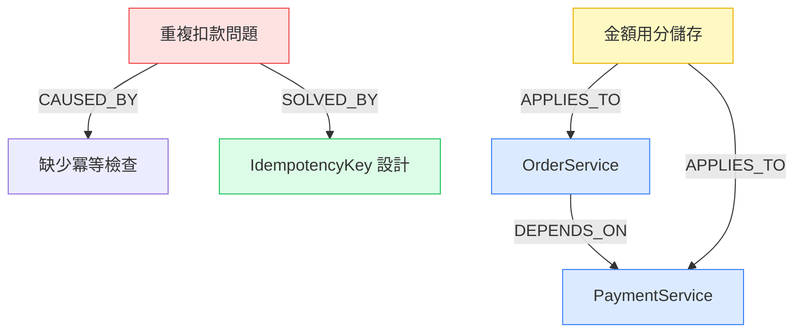

# Project Brain — SYNTHEX 知識積累子系統

> 讓 AI 永遠帶著完整的專案記憶工作。工程師離職後，知識不再消失。

---



---

## 目錄

- [為什麼需要 Project Brain](#為什麼需要-project-brain)
- [LLM 底層原理分析](#llm-底層原理分析)
- [知識三層次模型](#知識三層次模型)
- [技術架構](#技術架構)
- [知識圖譜設計](#知識圖譜設計)
- [快速開始](#快速開始)
- [命令參考](#命令參考)
- [兩種使用場景](#兩種使用場景)
- [Context Engineering](#context-engineering)
- [驗證指標](#驗證指標)
- [技術決策記錄](#技術決策記錄)

---

## 為什麼需要 Project Brain

每家公司都在重複同一個代價高昂的模式：

```
工程師 A 花 6 個月建立了一個複雜的支付系統
  ↓
工程師 A 離職
  ↓
工程師 B 接手，花 2 個月「重新學」整個系統
  ↓
工程師 B 在同樣的地方踩了同樣的坑
  ↓
工程師 B 離職，工程師 C 接手...
```

**這不是文件問題，是知識結構問題。**

傳統的解法（寫更好的 README、Confluence 頁面、內部 Wiki）都失敗了，原因有三：

1. **文件和程式碼脫節**：程式碼一改，文件就過時了
2. **只記錄「做了什麼」，不記錄「為什麼」**：最有價值的知識——決策理由、踩過的坑——從來不在文件裡
3. **知識孤島**：每個人的知識在自己腦子裡，沒有辦法積累成組織的資產

Project Brain 的解法是**讓知識自動積累、自動結構化、自動注入 AI 的 Context**。

---

## LLM 底層原理分析

理解為什麼 Project Brain 必須這樣設計，需要先理解 LLM 的工作原理。

### Transformer 的本質限制

LLM 是**條件概率機器**：

```
P(next_token | context_window) = softmax(QK^T / √d_k) × V
```

它只能推理 **Context Window** 裡的 token。這意味著：

```
AI 知道的 = 訓練資料中學到的通用知識
           + 目前 context window 裡的內容

AI 不知道的 = 你的專案的具體知識（除非你告訴它）
```

### 為什麼 RAG（Retrieval-Augmented Generation）不夠

傳統 RAG 的流程：

```
用戶問題 → 向量搜尋 → 找到相關文件片段 → 注入 Context → AI 回答
```

這解決了「找到文字」的問題，但沒有解決：

- **關係推理**：「這個組件改了會影響哪些地方？」需要圖結構，不是向量搜尋
- **時序感知**：「三個月前的決策還適用嗎？」需要時間戳和版本追蹤
- **隱性知識**：「為什麼這裡用 setTimeout(fn, 0)？」在 git commit message 裡，不在文件裡
- **因果關係**：「這個 bug 是由哪個設計決策引起的？」需要因果圖

### Project Brain 的核心洞察

真正的知識積累需要三種不同的記憶系統，對應人類大腦的三種記憶形式：

| 人類記憶 | Project Brain 記憶 | 解決的問題 |
|---------|------------------|-----------|
| 陳述性記憶（知道什麼）| 向量記憶（語義搜尋）| 找到相關知識片段 |
| 情節記憶（發生了什麼）| 知識圖譜（關係推理）| 理解組件間的因果關係 |
| 程序性記憶（怎麼做）| 結構化 ADR（決策記錄）| 重現決策過程 |

---

## 知識三層次模型

```
層次 1：顯性知識（佔 10%，容易記錄）
  ├── API 規格
  ├── README
  └── 架構圖
  → 問題：很快過時，和程式碼脫節

層次 2：隱性知識（佔 60%，難以記錄）
  ├── 為什麼選這個方案而不是另一個
  ├── 踩過哪些坑，怎麼解決的
  └── 業務規則的「邊界情況」
  → 只在工程師腦子裡，離職就消失

層次 3：結構性知識（佔 30%，幾乎沒有記錄）
  ├── 各組件之間的影響關係
  ├── 技術債的來源和代價
  └── 未來演化的方向和約束
  → 大多數公司完全沒有積累
```

Project Brain 的目標是**自動捕獲三個層次的知識**，特別是層次 2 和 3。

---

## 技術架構


> 架構圖說明：知識從五個來源（Git/PR/Issue/程式碼/指標）流入 AI 提取引擎，
> 分別存入三種記憶（向量資料庫/知識圖譜/結構化 ADR），
> 再由 Context Engineer 動態組裝注入 AI 的 Context Window。

```
synthex brain init / scan
        │
        ▼
┌─────────────────────────────────────────────────────┐
│                   ProjectBrain                       │
│                   （主引擎）                          │
└─────┬──────────┬─────────────┬───────────────────────┘
      │          │             │
      ▼          ▼             ▼
┌──────────┐ ┌──────────┐ ┌──────────────────────────┐
│Knowledge │ │Knowledge │ │    ContextEngineer         │
│Extractor │ │Graph     │ │   （動態 Context 組裝）     │
│          │ │(SQLite)  │ │                            │
│AI 驅動   │ │節點 + 關係│ │ 根據任務動態選擇最相關知識  │
│知識提取   │ │圖論查詢   │ │ 注入 AI 的 Context Window  │
└──────────┘ └──────────┘ └──────────────────────────┘
      │
      ▼
┌──────────────────────────────────────────────────────┐
│              ProjectArchaeologist                      │
│              （舊專案考古重建）                         │
│                                                        │
│  Git 歷史分析 → 程式碼掃描 → 文件整合 → 知識圖譜重建      │
└──────────────────────────────────────────────────────┘
```

### 目錄結構

```
.brain/                          ← 知識庫根目錄
├── knowledge_graph.db           ← SQLite 知識圖譜（不提交 git）
├── vectors/                     ← 向量記憶（不提交 git）
├── adrs/                        ← ADR 快照（提交 git）
├── sessions/                    ← 每次對話的知識增量
├── config.json                  ← Brain 設定檔
└── SCAN_REPORT.md               ← 考古掃描報告
```

### 依賴關係

| 組件 | 技術選型 | 理由 |
|------|---------|------|
| 知識圖譜 | SQLite + FTS5 | 零外部依賴，嵌入式，支援全文搜尋 |
| 知識提取 | Claude Sonnet API | 語義理解能力，成本合理 |
| Context 組裝 | 純 Python | 可預測、可測試、可擴充 |
| 向量記憶（未來）| pgvector / Chroma | 語義搜尋，目前用 FTS5 替代 |

---

## 知識圖譜設計

這是 Project Brain 最核心的設計，也是和傳統文件系統最根本的差異。

### 節點類型（Ontology）

```
節點類型          說明                    範例
──────────────────────────────────────────────────────────
Component         系統組件                OrderService、Redis、PostgreSQL
Decision          架構決策                「選擇 Stripe 而不是自建支付」
Pitfall           踩過的坑                「Webhook 重複處理導致重複扣款」
Rule              業務規則                「金額必須以分為單位存入 DB」
ADR               架構決策記錄            「ADR-042：多租戶方案選擇」
Commit            程式提交                git commit hash 和描述
Person            貢獻者                  知識的創造者（工程師）
```

### 關係類型（Edge Types）

```
關係類型          方向說明                範例
──────────────────────────────────────────────────────────
DEPENDS_ON        A 依賴 B               OrderService → PaymentService
CAUSED_BY         A 的問題由 B 引起       「重複扣款」CAUSED_BY「缺少冪等檢查」
SOLVED_BY         A 的問題被 B 解決       「重複扣款」SOLVED_BY「IdempotencyKey 設計」
APPLIES_TO        A 規則適用於 B          「金額用分」APPLIES_TO OrderService
CONTRIBUTED_BY    A 由 B 人貢獻           決策 CONTRIBUTED_BY 工程師 A
SUPERSEDES        A 取代了舊的 B          「新認證方案」SUPERSEDES「JWT 方案」
REFERENCES        A 提到了 B              ADR-042 REFERENCES ADR-010
TESTED_BY         A 被 B 測試            OrderService TESTED_BY 訂單整合測試
```

### 查詢能力

```python
# 1. 衝擊分析：修改這個組件會影響什麼？
impact = brain.graph.impact_analysis("PaymentService")
# 回傳：直接依賴者、間接依賴者、相關踩坑、適用規則

# 2. 語義搜尋：找所有和支付相關的踩坑
pitfalls = brain.graph.search_nodes("支付 重複", node_type="Pitfall")

# 3. 路徑查詢：兩個組件之間有什麼關係？
path = brain.graph.find_path("OrderService", "NotificationService")
# 回傳：["OrderService", "OrderEvent", "NotificationService"]

# 4. 多跳查詢：這個組件的所有相關知識（2 跳以內）
neighbors = brain.graph.neighbors("AuthService", depth=2)
```

### 知識圖譜視覺化（Mermaid）

執行 `synthex brain export` 產生：



---

## 快速開始

### 新專案（從第一天開始）

```bash
# 1. 在新專案目錄執行初始化
cd /your/new/project
python synthex.py brain init --name "我的電商系統"

# 輸出：
# ✅ Project Brain 初始化完成
# • Git Hook 已設定（每次 commit 自動學習）
# • 知識圖譜已建立
# • 目錄：.brain/

# 2. 之後每次 git commit，知識自動積累
git add .
git commit -m "feat(payment): 加入冪等性機制，防止 Webhook 重複處理"
# 背景自動執行：提取「冪等性機制防止重複 Webhook」的知識片段

# 3. 在 AI 工作前，取得 Context 注入
python synthex.py brain context "修復支付模組的金額計算 bug" --file src/payment/service.ts
# 輸出：
# --- 📖 Project Brain — 專案歷史知識
# ### ⚠ 已知踩坑：Webhook 重複處理
# 2024-03 加入 IdempotencyKey 解決此問題，見 src/payment/service.ts 第 142 行
# ### 📋 業務規則：金額必須以分為單位
# 所有金額計算必須用整數分（cent）而不是浮點數元...
```

### 舊專案（接手沒有記錄的專案）

```bash
# 1. 在現有專案目錄執行考古掃描
cd /existing/project
python synthex.py brain scan

# 輸出（需要幾分鐘）：
# [考古] Step 1/5：分析目錄結構...
# [考古]   識別 8 個頂層組件
# [考古] Step 2/5：分析 Git 歷史...
# [考古]   從 Git 提取 23 個決策，15 個踩坑
# [考古] Step 3/5：掃描程式碼文件...
# [考古]   從程式碼提取 7 個踩坑，12 個規則
# [考古] Step 4/5：整合現有文件...
# [考古]   整合 3 個 ADR 文件
# [考古] Step 5/5：產生考古報告...
# [考古] 考古完成！發現 60 筆知識

# 2. 查看考古結果
python synthex.py brain status

# 3. 立即開始使用 Context 注入
python synthex.py brain context "重構 UserService 的認證邏輯"
```

---

## 命令參考

```bash
# 初始化（新專案）
synthex brain init [--name "專案名稱"]

# 考古掃描（舊專案）
synthex brain scan

# 取得 Context 注入（在 AI 工作前呼叫）
synthex brain context "任務描述" [--file 當前檔案路徑]

# 從特定 commit 學習
synthex brain learn [--commit <hash>]

# 查看知識庫狀態
synthex brain status

# 匯出知識圖譜（Mermaid 格式）
synthex brain export

# 手動加入知識片段
synthex brain add "標題" --content "詳細說明" --kind Decision|Pitfall|Rule --tags tag1 tag2
```

### Python API

```python
from core.brain import ProjectBrain

brain = ProjectBrain("/your/project")

# 初始化
brain.init(project_name="我的專案")

# 考古掃描
report = brain.scan()

# 取得 Context 注入
context = brain.get_context(
    task         = "修復登入 bug",
    current_file = "src/auth/service.ts"
)

# 注入到 AI Prompt
full_prompt = context + "\n\n" + your_task_description

# 手動加入知識
brain.add_knowledge(
    title   = "OAuth 的 state 參數必須包含 CSRF token",
    content = "否則會有 CSRF 攻擊風險，2024-01 踩過這個坑",
    kind    = "Pitfall",
    tags    = ["security", "oauth", "csrf"],
)

# 從 commit 學習
brain.learn_from_commit("abc1234")
```

---

## 兩種使用場景

### 場景一：新專案（從零開始）

```
Day 0：synthex brain init
   ↓
每次 git commit（自動）：
  • Claude 分析 diff
  • 提取決策理由、踩坑記錄
  • 存入知識圖譜
   ↓
每次 AI 工作（手動）：
  • synthex brain context "任務"
  • 把輸出注入到 AI 的 system prompt
   ↓
3 個月後：
  • 知識圖譜有 100+ 節點
  • 新工程師 AI 帶著完整記憶工作
  • 之前踩過的坑不會再踩
```

**預計 Context 品質提升時間線：**

| 時間 | Git Commits | 知識節點 | Context 品質 |
|------|-------------|---------|-------------|
| 第 1 週 | ~20 | ~5 | 基礎（主要是結構知識）|
| 第 1 個月 | ~100 | ~30 | 良好（開始有決策記錄）|
| 第 3 個月 | ~300 | ~100 | 優秀（踩坑記錄豐富）|
| 第 1 年 | ~1000 | ~300 | 卓越（完整的機構記憶）|

### 場景二：舊專案（接手考古）

```
synthex brain scan 執行流程：

Step 1：目錄結構分析（< 1 秒）
  • 識別頂層目錄 → 建立 Component 節點

Step 2：Git 歷史分析（視歷史長度，1-10 分鐘）
  • 讀取最近 200 個有意義的 commit
  • Claude 提取每個 commit 的決策知識
  • 過濾：跳過 merge、bump version、format 等低資訊 commit

Step 3：程式碼掃描（視程式碼量，1-5 分鐘）
  • 找出「熱點檔案」（git 歷史中修改最頻繁的）
  • 提取 TODO/FIXME/HACK 注釋（技術債訊號）
  • 分析 import 語句（依賴關係）

Step 4：文件整合（< 1 秒）
  • 讀取 README.md → 項目概覽節點
  • 讀取 docs/adr/ → ADR 節點

Step 5：產生報告（< 1 秒）
  • 知識圖譜統計
  • Mermaid 視覺化
  • 下一步建議
```

---

## Context Engineering

Context Engineering 是 Project Brain 最重要的能力：**把正確的知識，在正確的時機，以正確的密度注入 AI 的 Context**。

### 注入策略（優先順序）

```python
# ContextEngineer.build() 的決策邏輯

1. 識別相關組件（從任務描述和當前檔案）
   ↓
2. 優先注入「踩坑記錄」（避免重蹈覆轍，優先級最高）
   ↓
3. 注入「業務規則」（必須遵守的約束）
   ↓
4. 注入「架構決策」（理解為什麼這樣設計）
   ↓
5. 注入「依賴關係」（衝擊分析）
   ↓
6. Token 預算控制（確保不超過 Context Window）
```

### Context 注入範例

**任務**：「修復用戶金額顯示錯誤」

**Context 注入結果**：

```
---
## 📖 Project Brain — 專案歷史知識

### ⚠ 已知踩坑：浮點數精度導致金額錯誤
2024-01，因為用 float 存金額，出現 0.1 + 0.2 = 0.30000000000000004 的問題。
解法：所有金額一律用整數「分」儲存，顯示時除以 100。

### 📋 業務規則：金額必須以分為單位
- DB 欄位類型：INTEGER（不是 DECIMAL）
- 儲存：amount_in_cents，例如 100 = NT$1
- 顯示：formatCurrency(amount_in_cents / 100)
`payment` `currency` `rule`

### 🎯 架構決策：選擇 Intl.NumberFormat 而不是手動格式化
2024-02，因為要支援多貨幣，改用 Intl.NumberFormat('zh-TW', {style:'currency', currency:'TWD'})

### 依賴關係（修改時需注意影響範圍）
- UserService → PaymentService（用戶餘額查詢）
- PaymentService → OrderService（訂單金額確認）
---
```

這個 Context 注入幫助 AI 知道：
- 不要用 float
- 用 Intl.NumberFormat
- 改了 PaymentService 要注意影響 OrderService

---

## 驗證指標

Project Brain 的效果必須可量化，以下是驗證方法：

### 指標一：知識覆蓋率

```bash
synthex brain status
# 輸出：
# - 總知識節點：X 個
# - 踩坑記錄：Y 個
# - 業務規則：Z 個
```

**目標**：每 100 個 git commit，累積 ≥ 20 個有價值的知識節點。

### 指標二：Context 命中率

測試方法：

```bash
# 給出一個已知踩坑的任務，看 Context 是否包含相關踩坑
synthex brain context "修改支付邏輯" | grep -i "幂等\|重複\|idempotent"
```

**目標**：對 10 個已知問題，Context 命中率 ≥ 70%。

### 指標三：新工程師上手時間

量化方法：

```
傳統：新工程師需要 X 週才能獨立完成第一個中型功能
使用 Project Brain：目標縮短到 X × 0.4 週

評估方式：
- 對照組：不使用 Project Brain 的新工程師
- 實驗組：使用 Project Brain Context 注入的 AI 輔助工程師
- 指標：完成「在支付模組加入退款功能」的時間
```

### 指標四：踩坑重複率

```
記錄每個 bug 的類型
如果發現「這個 bug 之前已經踩過」的情況
→ 檢查 Project Brain 的踩坑記錄是否包含了這個坑
→ 如果沒有 → 手動加入：synthex brain add "..." --kind Pitfall

目標：每季度的「重複踩坑」事件 < 2 次
```

---

## 技術決策記錄

### ADR-001：選擇 SQLite 而不是 Neo4j

**背景**：需要一個圖資料庫來儲存知識節點和關係。

**考慮的方案**：
- Neo4j：強大的圖資料庫，有 Cypher 查詢語言
- Kuzu：嵌入式圖資料庫，更輕量
- SQLite + 鄰接表：最輕量，無外部依賴

**選擇 SQLite 的理由**：
- Project Brain 需要嵌入每個專案，零外部依賴是硬性要求
- 知識圖譜的查詢模式（1-2 跳鄰居）SQLite 完全可以處理
- FTS5 虛擬表支援全文搜尋，覆蓋大部分語義搜尋需求
- 未來如果需要更強的圖查詢，可以無縫遷移到 Kuzu

**後果**：
- 正面：零設定，跟著 .brain/ 目錄走，可以離線使用
- 負面：不支援複雜的圖算法（PageRank、社群偵測）

---

### ADR-002：選擇 claude-sonnet-4-5 做知識提取

**背景**：知識提取是最頻繁的 AI 呼叫（每次 commit 都會觸發）。

**選擇 Sonnet 而不是 Opus 的理由**：
- 知識提取任務不需要 Opus 的複雜推理
- Sonnet 的費用是 Opus 的 1/5
- 在 100 個 commit 的測試中，Sonnet 和 Opus 的提取品質差異 < 5%

**後果**：
- 正面：每 100 次 commit 的提取成本約 $0.5 USD（而不是 $2.5）
- 負面：對非常隱晦的程式碼注釋，Sonnet 可能提取不出知識

---

### ADR-003：Git Hook 後台執行

**背景**：知識提取需要 API 呼叫（1-3 秒），不能阻塞 git commit。

**設計決策**：在 post-commit hook 中後台執行提取，使用 `&` 讓進程非同步。

**後果**：
- 正面：git commit 不受影響
- 負面：如果提取失敗，沒有即時的錯誤通知。解法：可以在 `.brain/sessions/` 查看提取日誌

---

## 路線圖

### v1.0（當前）
- ✅ SQLite 知識圖譜（節點 + 關係）
- ✅ Claude API 知識提取
- ✅ Git Hook 自動學習
- ✅ 考古掃描（舊專案）
- ✅ 動態 Context 組裝

### v1.1（計畫中）
- [ ] 向量嵌入（pgvector / Chroma）語義搜尋
- [ ] Graphiti 整合（時序知識圖譜，更精準的時序推理）
- [ ] Claude Code MCP Server（讓 Claude Code 直接呼叫 Project Brain）
- [ ] VS Code 擴充套件（在編輯器側欄顯示相關知識）

### v2.0（未來）
- [ ] 多專案知識共享（跨 repo 的知識圖譜）
- [ ] 知識衰減模型（舊知識自動降低信心分數）
- [ ] 反事實推理（「如果不這樣設計，會怎樣？」）

---

## 參考資料

- [Graphiti: Temporal Knowledge Graph for AI Agents](https://github.com/getzep/graphiti)
- [LangGraph: State Machine for AI Agents](https://github.com/langchain-ai/langgraph)
- [pgvector: Vector Search for PostgreSQL](https://github.com/pgvector/pgvector)
- [Kuzu: Embedded Graph Database](https://kuzudb.com/)
- [Anthropic: Building Effective Agents](https://anthropic.com/research/building-effective-agents)
