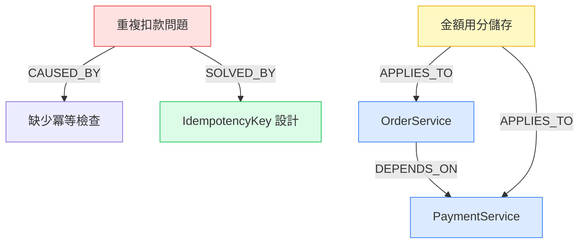

# Project Brain — SYNTHEX 知識積累子系統

> 讓 AI 永遠帶著完整的專案記憶工作。工程師離職後，知識不再消失。

---


---

## 目錄

- [為什麼需要 Project Brain](#為什麼需要-project-brain)
- [LLM 底層原理分析](#llm-底層原理分析)
- [知識三層次模型](#知識三層次模型)
- [技術架構](#技術架構)
- [知識圖譜設計](#知識圖譜設計)
- [快速開始](#快速開始)
- [命令參考](#命令參考)
- [兩種使用場景](#兩種使用場景)
- [Context Engineering](#context-engineering)
- [驗證指標](#驗證指標)
- [技術決策記錄](#技術決策記錄)

---

## 為什麼需要 Project Brain

每家公司都在重複同一個代價高昂的模式：

```
工程師 A 花 6 個月建立了一個複雜的支付系統
  ↓
工程師 A 離職
  ↓
工程師 B 接手，花 2 個月「重新學」整個系統
  ↓
工程師 B 在同樣的地方踩了同樣的坑
  ↓
工程師 B 離職，工程師 C 接手...
```

**這不是文件問題，是知識結構問題。**

傳統的解法（寫更好的 README、Confluence 頁面、內部 Wiki）都失敗了，原因有三：

1. **文件和程式碼脫節**：程式碼一改，文件就過時了
2. **只記錄「做了什麼」，不記錄「為什麼」**：最有價值的知識——決策理由、踩過的坑——從來不在文件裡
3. **知識孤島**：每個人的知識在自己腦子裡，沒有辦法積累成組織的資產

Project Brain 的解法是**讓知識自動積累、自動結構化、自動注入 AI 的 Context**。

---

## LLM 底層原理分析

理解為什麼 Project Brain 必須這樣設計，需要先理解 LLM 的工作原理。

### Transformer 的本質限制

LLM 是**條件概率機器**：

```
P(next_token | context_window) = softmax(QK^T / √d_k) × V
```

它只能推理 **Context Window** 裡的 token。這意味著：

```
AI 知道的 = 訓練資料中學到的通用知識
           + 目前 context window 裡的內容

AI 不知道的 = 你的專案的具體知識（除非你告訴它）
```

### 為什麼 RAG（Retrieval-Augmented Generation）不夠

傳統 RAG 的流程：

```
用戶問題 → 向量搜尋 → 找到相關文件片段 → 注入 Context → AI 回答
```

這解決了「找到文字」的問題，但沒有解決：

- **關係推理**：「這個組件改了會影響哪些地方？」需要圖結構，不是向量搜尋
- **時序感知**：「三個月前的決策還適用嗎？」需要時間戳和版本追蹤
- **隱性知識**：「為什麼這裡用 setTimeout(fn, 0)？」在 git commit message 裡，不在文件裡
- **因果關係**：「這個 bug 是由哪個設計決策引起的？」需要因果圖

### Project Brain 的核心洞察

真正的知識積累需要三種不同的記憶系統，對應人類大腦的三種記憶形式：

| 人類記憶               | Project Brain 記憶     | 解決的問題           |
| ---------------------- | ---------------------- | -------------------- |
| 陳述性記憶（知道什麼） | 向量記憶（語義搜尋）   | 找到相關知識片段     |
| 情節記憶（發生了什麼） | 知識圖譜（關係推理）   | 理解組件間的因果關係 |
| 程序性記憶（怎麼做）   | 結構化 ADR（決策記錄） | 重現決策過程         |

---

## 知識三層次模型

```
層次 1：顯性知識（佔 10%，容易記錄）
  ├── API 規格
  ├── README
  └── 架構圖
  → 問題：很快過時，和程式碼脫節

層次 2：隱性知識（佔 60%，難以記錄）
  ├── 為什麼選這個方案而不是另一個
  ├── 踩過哪些坑，怎麼解決的
  └── 業務規則的「邊界情況」
  → 只在工程師腦子裡，離職就消失

層次 3：結構性知識（佔 30%，幾乎沒有記錄）
  ├── 各組件之間的影響關係
  ├── 技術債的來源和代價
  └── 未來演化的方向和約束
  → 大多數公司完全沒有積累
```

Project Brain 的目標是**自動捕獲三個層次的知識**，特別是層次 2 和 3。

---

## 技術架構


> 架構圖說明：知識從五個來源（Git/PR/Issue/程式碼/指標）流入 AI 提取引擎，
> 分別存入三種記憶（向量資料庫/知識圖譜/結構化 ADR），
> 再由 Context Engineer 動態組裝注入 AI 的 Context Window。

```
synthex brain init / scan
        │
        ▼
┌─────────────────────────────────────────────────────┐
│                   ProjectBrain                       │
│                   （主引擎）                          │
└─────┬──────────┬─────────────┬───────────────────────┘
      │          │             │
      ▼          ▼             ▼
┌──────────┐ ┌──────────┐ ┌──────────────────────────┐
│Knowledge │ │Knowledge │ │    ContextEngineer         │
│Extractor │ │Graph     │ │   （動態 Context 組裝）     │
│          │ │(SQLite)  │ │                            │
│AI 驅動   │ │節點 + 關係│ │ 根據任務動態選擇最相關知識  │
│知識提取   │ │圖論查詢   │ │ 注入 AI 的 Context Window  │
└──────────┘ └──────────┘ └──────────────────────────┘
      │
      ▼
┌──────────────────────────────────────────────────────┐
│              ProjectArchaeologist                      │
│              （舊專案考古重建）                         │
│                                                        │
│  Git 歷史分析 → 程式碼掃描 → 文件整合 → 知識圖譜重建      │
└──────────────────────────────────────────────────────┘
```

### 目錄結構

```
.brain/                          ← 知識庫根目錄
├── knowledge_graph.db           ← SQLite 知識圖譜（不提交 git）
├── vectors/                     ← 向量記憶（不提交 git）
├── adrs/                        ← ADR 快照（提交 git）
├── sessions/                    ← 每次對話的知識增量
├── config.json                  ← Brain 設定檔
└── SCAN_REPORT.md               ← 考古掃描報告
```

### 依賴關係

| 組件             | 技術選型          | 理由                             |
| ---------------- | ----------------- | -------------------------------- |
| 知識圖譜         | SQLite + FTS5     | 零外部依賴，嵌入式，支援全文搜尋 |
| 知識提取         | Claude Sonnet API | 語義理解能力，成本合理           |
| Context 組裝     | 純 Python         | 可預測、可測試、可擴充           |
| 向量記憶（未來） | pgvector / Chroma | 語義搜尋，目前用 FTS5 替代       |

---

## 知識圖譜設計

這是 Project Brain 最核心的設計，也是和傳統文件系統最根本的差異。

### 節點類型（Ontology）

```
節點類型          說明                    範例
──────────────────────────────────────────────────────────
Component         系統組件                OrderService、Redis、PostgreSQL
Decision          架構決策                「選擇 Stripe 而不是自建支付」
Pitfall           踩過的坑                「Webhook 重複處理導致重複扣款」
Rule              業務規則                「金額必須以分為單位存入 DB」
ADR               架構決策記錄            「ADR-042：多租戶方案選擇」
Commit            程式提交                git commit hash 和描述
Person            貢獻者                  知識的創造者（工程師）
```

### 關係類型（Edge Types）

```
關係類型          方向說明                範例
──────────────────────────────────────────────────────────
DEPENDS_ON        A 依賴 B               OrderService → PaymentService
CAUSED_BY         A 的問題由 B 引起       「重複扣款」CAUSED_BY「缺少冪等檢查」
SOLVED_BY         A 的問題被 B 解決       「重複扣款」SOLVED_BY「IdempotencyKey 設計」
APPLIES_TO        A 規則適用於 B          「金額用分」APPLIES_TO OrderService
CONTRIBUTED_BY    A 由 B 人貢獻           決策 CONTRIBUTED_BY 工程師 A
SUPERSEDES        A 取代了舊的 B          「新認證方案」SUPERSEDES「JWT 方案」
REFERENCES        A 提到了 B              ADR-042 REFERENCES ADR-010
TESTED_BY         A 被 B 測試            OrderService TESTED_BY 訂單整合測試
```

### 查詢能力

```python
# 1. 衝擊分析：修改這個組件會影響什麼？
impact = brain.graph.impact_analysis("PaymentService")
# 回傳：直接依賴者、間接依賴者、相關踩坑、適用規則

# 2. 語義搜尋：找所有和支付相關的踩坑
pitfalls = brain.graph.search_nodes("支付 重複", node_type="Pitfall")

# 3. 路徑查詢：兩個組件之間有什麼關係？
path = brain.graph.find_path("OrderService", "NotificationService")
# 回傳：["OrderService", "OrderEvent", "NotificationService"]

# 4. 多跳查詢：這個組件的所有相關知識（2 跳以內）
neighbors = brain.graph.neighbors("AuthService", depth=2)
```

### 知識圖譜視覺化（Mermaid）

執行 `synthex brain export` 產生：



---

## 快速開始

### 新專案（從第一天開始）

```bash
# 1. 在新專案目錄執行初始化
cd /your/new/project
python synthex.py brain init --name "我的電商系統"

# 輸出：
# ✅ Project Brain 初始化完成
# • Git Hook 已設定（每次 commit 自動學習）
# • 知識圖譜已建立
# • 目錄：.brain/

# 2. 之後每次 git commit，知識自動積累
git add .
git commit -m "feat(payment): 加入冪等性機制，防止 Webhook 重複處理"
# 背景自動執行：提取「冪等性機制防止重複 Webhook」的知識片段

# 3. 在 AI 工作前，取得 Context 注入
python synthex.py brain context "修復支付模組的金額計算 bug" --file src/payment/service.ts
# 輸出：
# --- 📖 Project Brain — 專案歷史知識
# ### ⚠ 已知踩坑：Webhook 重複處理
# 2024-03 加入 IdempotencyKey 解決此問題，見 src/payment/service.ts 第 142 行
# ### 📋 業務規則：金額必須以分為單位
# 所有金額計算必須用整數分（cent）而不是浮點數元...
```

### 舊專案（接手沒有記錄的專案）

```bash
# 1. 在現有專案目錄執行考古掃描
cd /existing/project
python synthex.py brain scan

# 輸出（需要幾分鐘）：
# [考古] Step 1/5：分析目錄結構...
# [考古]   識別 8 個頂層組件
# [考古] Step 2/5：分析 Git 歷史...
# [考古]   從 Git 提取 23 個決策，15 個踩坑
# [考古] Step 3/5：掃描程式碼文件...
# [考古]   從程式碼提取 7 個踩坑，12 個規則
# [考古] Step 4/5：整合現有文件...
# [考古]   整合 3 個 ADR 文件
# [考古] Step 5/5：產生考古報告...
# [考古] 考古完成！發現 60 筆知識

# 2. 查看考古結果
python synthex.py brain status

# 3. 立即開始使用 Context 注入
python synthex.py brain context "重構 UserService 的認證邏輯"
```

---

## 命令參考

```bash
# 初始化（新專案）
synthex brain init [--name "專案名稱"]

# 考古掃描（舊專案）
synthex brain scan

# 取得 Context 注入（在 AI 工作前呼叫）
synthex brain context "任務描述" [--file 當前檔案路徑]

# 從特定 commit 學習
synthex brain learn [--commit <hash>]

# 查看知識庫狀態
synthex brain status

# 匯出知識圖譜（Mermaid 格式）
synthex brain export

# 手動加入知識片段
synthex brain add "標題" --content "詳細說明" --kind Decision|Pitfall|Rule --tags tag1 tag2
```

### Python API

```python
from core.brain import ProjectBrain

brain = ProjectBrain("/your/project")

# 初始化
brain.init(project_name="我的專案")

# 考古掃描
report = brain.scan()

# 取得 Context 注入
context = brain.get_context(
    task         = "修復登入 bug",
    current_file = "src/auth/service.ts"
)

# 注入到 AI Prompt
full_prompt = context + "\n\n" + your_task_description

# 手動加入知識
brain.add_knowledge(
    title   = "OAuth 的 state 參數必須包含 CSRF token",
    content = "否則會有 CSRF 攻擊風險，2024-01 踩過這個坑",
    kind    = "Pitfall",
    tags    = ["security", "oauth", "csrf"],
)

# 從 commit 學習
brain.learn_from_commit("abc1234")
```

---

## Project Brain × SYNTHEX — 兩種使用場景

> **核心原則**
>
> - **自動觸發**：Context 注入（每次 `ship`/`feature`/`fix` 都自動）、Git Hook 學習（每次 `git commit` 都自動）
> - **手動觸發**：`brain init` 或 `brain scan`（只需一次）、`brain add`（選填補充）

---

### 場景一：全新專案

從零開始，同時建立開發系統和長期記憶。

**完整流程：**

```
[你] python synthex.py brain init          ← 手動（僅一次）
      │
      │  建立 .brain/、設定 Git Hook、建立知識圖譜
      ▼
[你] python synthex.py discover "模糊想法"  ← 手動
      │
      │  (自動) Brain.get_context() 注入已知背景知識
      │  6 個 Agent 深挖需求，產出 docs/DISCOVER_FINAL.md
      ▼
[你] python synthex.py ship "完整需求" --budget 5.0  ← 手動
      │
      │  Phase 4 NEXUS 架構設計
      │    (自動) Brain 注入相關踩坑 + ADR
      │  Phase 9+10 BYTE+STACK 實作
      │    (自動) Brain 注入業務規則 + 依賴關係
      │  Phase 11 PROBE+TRACE 測試
      │    (自動) Brain 注入已知的邊界條件
      ▼
[你] git commit -m "feat: 完成登入功能"      ← 正常 git 操作
      │
      │  (自動) Git Hook → Brain.learn_from_commit()
      │  Claude 分析 diff，提取決策 / 踩坑 / 規則
      │  存入知識圖譜（背景執行，不阻塞你）
      ▼
 知識圖譜自動成長（每次 commit 都在積累）
      ↻ 下次工作，Brain 知道得更多
```

**時間線：**

| 時間      | commit 數 | 知識節點 | Brain 效果                 |
| --------- | --------- | -------- | -------------------------- |
| 第 1 週   | ~20       | ~5       | 基礎結構知識               |
| 第 1 個月 | ~100      | ~30      | 開始有決策記錄             |
| 第 3 個月 | ~300      | ~100     | 踩坑記錄豐富，不再重蹈覆轍 |
| 第 1 年   | ~1000     | ~300     | 完整機構記憶               |

---

### 場景二：現有專案（接手 / 新功能 / 修復 / 重構）

接手沒有記錄的舊專案，或在現有專案上持續開發。

**接手舊專案（只需一次）：**

```
[你] python synthex.py brain scan           ← 手動（僅一次，約 3-10 分鐘）
      │
      │  Step 1：分析目錄結構，建立組件節點
      │  Step 2：分析 Git 歷史（最近 200 commits）
      │          Claude 提取每個 commit 的決策知識
      │  Step 3：掃描「熱點」程式碼（修改最頻繁的檔案）
      │          提取 TODO/FIXME/HACK 注釋
      │  Step 4：整合現有 README / docs / ADR
      │  Step 5：產出 .brain/SCAN_REPORT.md
      ▼
 知識圖譜重建完成，可以立即使用
```

**日常開發（完全自動）：**

```
[你] python synthex.py feature "新增訂單退款功能"  ← 手動
      │
      │  (自動) Brain.get_context("新增訂單退款功能", "src/order/")
      │          搜尋 → 「支付模組有重複扣款的踩坑記錄」
      │          搜尋 → 「金額必須以分為單位儲存（業務規則）」
      │          搜尋 → 「ADR-042：冪等性設計」
      │          → 全部注入 Agent 的 Prompt 前端
      ▼
 AI Agent 帶著完整記憶工作
 知道之前踩過什麼坑，不會重複犯錯
      │
      ▼
[你] git commit -m "feat: 加入退款 API"      ← 正常 git 操作
      │
      │  (自動) Git Hook 學習新知識
      ▼
 知識圖譜持續成長 ↻
```

**四種操作的觸發方式：**

| 操作     | 命令                            | Brain 介入方式              |
| -------- | ------------------------------- | --------------------------- |
| 新增功能 | `synthex.py feature "描述"`     | 自動注入相關踩坑 + 依賴關係 |
| 修復 Bug | `synthex.py fix "bug 描述"`     | 自動注入歷史相似 bug 的解法 |
| 除錯     | `synthex.py investigate "問題"` | 自動注入可能的根本原因      |
| 重構     | `synthex.py ship "重構需求"`    | 自動注入完整架構脈絡        |

---

### 哪些是自動的，哪些是手動的

```
自動（完全不需要手動觸發）：
  ✓ git commit 後，知識自動積累（Git Hook）
  ✓ 每次 AI 工作前，Context 自動注入（orchestrator 內建）
  ✓ 知識圖譜自動成長

手動（只需一次）：
  ✓ brain init — 新專案初始化
  ✓ brain scan — 舊專案考古掃描

選填（隨時補充）：
  ✓ brain add "知識" — 手動記錄重要決策
  ✓ brain status    — 查看目前記憶狀態
  ✓ brain context   — 測試 Context 注入效果
```

---

## Context Engineering

Context Engineering 是 Project Brain 最重要的能力：**把正確的知識，在正確的時機，以正確的密度注入 AI 的 Context**。

### 注入策略（優先順序）

```python
# ContextEngineer.build() 的決策邏輯

1. 識別相關組件（從任務描述和當前檔案）
   ↓
2. 優先注入「踩坑記錄」（避免重蹈覆轍，優先級最高）
   ↓
3. 注入「業務規則」（必須遵守的約束）
   ↓
4. 注入「架構決策」（理解為什麼這樣設計）
   ↓
5. 注入「依賴關係」（衝擊分析）
   ↓
6. Token 預算控制（確保不超過 Context Window）
```

### Context 注入範例

**任務**：「修復用戶金額顯示錯誤」

**Context 注入結果**：

```
---
## 📖 Project Brain — 專案歷史知識

### ⚠ 已知踩坑：浮點數精度導致金額錯誤
2024-01，因為用 float 存金額，出現 0.1 + 0.2 = 0.30000000000000004 的問題。
解法：所有金額一律用整數「分」儲存，顯示時除以 100。

### 📋 業務規則：金額必須以分為單位
- DB 欄位類型：INTEGER（不是 DECIMAL）
- 儲存：amount_in_cents，例如 100 = NT$1
- 顯示：formatCurrency(amount_in_cents / 100)
`payment` `currency` `rule`

### 🎯 架構決策：選擇 Intl.NumberFormat 而不是手動格式化
2024-02，因為要支援多貨幣，改用 Intl.NumberFormat('zh-TW', {style:'currency', currency:'TWD'})

### 依賴關係（修改時需注意影響範圍）
- UserService → PaymentService（用戶餘額查詢）
- PaymentService → OrderService（訂單金額確認）
---
```

這個 Context 注入幫助 AI 知道：

- 不要用 float
- 用 Intl.NumberFormat
- 改了 PaymentService 要注意影響 OrderService

---

## 驗證指標

Project Brain 的效果必須可量化，以下是驗證方法：

### 指標一：知識覆蓋率

```bash
synthex brain status
# 輸出：
# - 總知識節點：X 個
# - 踩坑記錄：Y 個
# - 業務規則：Z 個
```

**目標**：每 100 個 git commit，累積 ≥ 20 個有價值的知識節點。

### 指標二：Context 命中率

測試方法：

```bash
# 給出一個已知踩坑的任務，看 Context 是否包含相關踩坑
synthex brain context "修改支付邏輯" | grep -i "幂等\|重複\|idempotent"
```

**目標**：對 10 個已知問題，Context 命中率 ≥ 70%。

### 指標三：新工程師上手時間

量化方法：

```
傳統：新工程師需要 X 週才能獨立完成第一個中型功能
使用 Project Brain：目標縮短到 X × 0.4 週

評估方式：
- 對照組：不使用 Project Brain 的新工程師
- 實驗組：使用 Project Brain Context 注入的 AI 輔助工程師
- 指標：完成「在支付模組加入退款功能」的時間
```

### 指標四：踩坑重複率

```
記錄每個 bug 的類型
如果發現「這個 bug 之前已經踩過」的情況
→ 檢查 Project Brain 的踩坑記錄是否包含了這個坑
→ 如果沒有 → 手動加入：synthex brain add "..." --kind Pitfall

目標：每季度的「重複踩坑」事件 < 2 次
```

---

## 技術決策記錄

### ADR-001：選擇 SQLite 而不是 Neo4j

**背景**：需要一個圖資料庫來儲存知識節點和關係。

**考慮的方案**：

- Neo4j：強大的圖資料庫，有 Cypher 查詢語言
- Kuzu：嵌入式圖資料庫，更輕量
- SQLite + 鄰接表：最輕量，無外部依賴

**選擇 SQLite 的理由**：

- Project Brain 需要嵌入每個專案，零外部依賴是硬性要求
- 知識圖譜的查詢模式（1-2 跳鄰居）SQLite 完全可以處理
- FTS5 虛擬表支援全文搜尋，覆蓋大部分語義搜尋需求
- 未來如果需要更強的圖查詢，可以無縫遷移到 Kuzu

**後果**：

- 正面：零設定，跟著 .brain/ 目錄走，可以離線使用
- 負面：不支援複雜的圖算法（PageRank、社群偵測）

---

### ADR-002：選擇 claude-sonnet-4-5 做知識提取

**背景**：知識提取是最頻繁的 AI 呼叫（每次 commit 都會觸發）。

**選擇 Sonnet 而不是 Opus 的理由**：

- 知識提取任務不需要 Opus 的複雜推理
- Sonnet 的費用是 Opus 的 1/5
- 在 100 個 commit 的測試中，Sonnet 和 Opus 的提取品質差異 < 5%

**後果**：

- 正面：每 100 次 commit 的提取成本約 $0.5 USD（而不是 $2.5）
- 負面：對非常隱晦的程式碼注釋，Sonnet 可能提取不出知識

---

### ADR-003：Git Hook 後台執行

**背景**：知識提取需要 API 呼叫（1-3 秒），不能阻塞 git commit。

**設計決策**：在 post-commit hook 中後台執行提取，使用 `&` 讓進程非同步。

**後果**：

- 正面：git commit 不受影響
- 負面：如果提取失敗，沒有即時的錯誤通知。解法：可以在 `.brain/sessions/` 查看提取日誌

---

## 路線圖

### v1.0（當前）

- ✅ SQLite 知識圖譜（節點 + 關係）
- ✅ Claude API 知識提取
- ✅ Git Hook 自動學習
- ✅ 考古掃描（舊專案）
- ✅ 動態 Context 組裝

### v1.1（已完成）

#### 1. 向量記憶（Chroma 語義搜尋）— `core/brain/vector_memory.py`

取代 FTS5 精確關鍵字比對，改為語義向量搜尋。詢問「支付問題」
也能找到標題是「Stripe Webhook 重複觸發」的踩坑記錄。

```python
from core.brain import VectorMemory
vm = VectorMemory(brain_dir)
results = vm.search("支付金額計算錯誤", top_k=5)
# → 回傳語義相近的知識，包含 similarity 分數
```

安全設計：路徑驗證（只允許 .brain/ 內部）、輸入長度限制、
匿名遙測關閉（`anonymized_telemetry=False`）、集合上限 50,000 筆。
不可用時自動降級到 FTS5，主流程不受影響。

---

#### 2. 時序知識圖譜（Graphiti 啟發）— `core/brain/temporal_graph.py`

每條邊帶有 `valid_from`、`valid_until`、`confidence` 和衰減率。
可以問「三個月前這個組件的依賴是什麼」，或「這條知識現在還可信嗎」。

```python
from core.brain import TemporalGraph
tg = TemporalGraph(graph)

# 加入帶時效的邊
tg.add_temporal_edge("OrderService", "DEPENDS_ON", "PaymentService",
                     confidence=0.95, valid_from="2024-01-15T09:00:00")

# 時間點查詢（過去三個月的狀態）
history = tg.at_time("OrderService", "2024-01-15T00:00:00")

# 信心衰減曲線
timeline = tg.confidence_timeline("OrderService", "PaymentService")
```

衰減模型：`confidence(t) = c₀ × e^(-λ × days)`。
因果關係（λ=0.001）幾乎不衰減；引用關係（λ=0.01）衰減較快。

---

#### 3. MCP Server — `core/brain/mcp_server.py`

讓 Claude Code 直接透過 MCP 協議呼叫 Project Brain，
無需透過命令列。

```json
{
  "mcpServers": {
    "project-brain": {
      "command": "python",
      "args": ["-m", "core.brain.mcp_server"],
      "env": { "BRAIN_WORKDIR": "/your/project" }
    }
  }
}
```

提供 5 個 MCP Tools：

- `get_context(task, file)` — 動態 Context 注入
- `search_knowledge(query, kind, top_k)` — 語義搜尋
- `impact_analysis(component)` — 衝擊分析
- `add_knowledge(title, content, kind, tags)` — 手動加入
- `brain_status()` — 知識庫狀態

安全設計：Rate Limiting（60 RPM）、輸入驗證、workdir 驗證、
錯誤訊息不洩漏系統路徑。

---

#### 4. VS Code 擴充套件 — `vscode-extension/`

在編輯器側欄即時顯示和當前檔案相關的知識。

```
vscode-extension/
├── package.json          ← 擴充套件描述和命令定義
├── tsconfig.json         ← TypeScript 編譯設定
├── .vscode/launch.json   ← 除錯設定
├── icons/brain.svg       ← 側欄圖標
└── src/extension.ts      ← 主要邏輯（Tree View + 命令）
```

功能：

- 側欄 Tree View 顯示相關知識（切換檔案自動更新）
- 命令：Refresh / 語義搜尋 / 加入知識 / 顯示 Context / 開啟圖譜
- Debounce 自動刷新（避免頻繁呼叫）
- 編譯：`cd vscode-extension && npm install && npm run compile`

安全設計：子進程用 argv 陣列（不用 shell）、使用者輸入長度限制
（200 字）、緩衝大小限制（50KB）、timeout 保護（10s）。

### v2.0（已完成）

#### 1. SharedRegistry — 多專案知識共享 — `core/brain/v2/shared_registry.py`

打破知識孤島：讓同公司多個 repo 的知識可以安全流動。

**架構**：全域共享庫位於 `~/.brain_shared/registry.db`，每個專案有唯一
`namespace`，知識分三個可見性層級（`private` / `team` / `public`）。

```bash
# 發布踩坑到公司共享庫（team 可見）
python synthex.py brain share "Stripe Webhook 重複觸發" \
  --content "需要 IdempotencyKey，否則退款重複執行" \
  --kind Pitfall --visibility team

# 在另一個專案查詢跨 repo 踩坑
python synthex.py brain query-shared "支付 重複"
```

```python
from core.brain.v2 import SharedRegistry

reg = SharedRegistry(namespace="company-ecommerce", visibility="team")

# 發布（高信心才分享，低於 0.7 自動拒絕）
reg.publish("API Rate Limit 踩坑", "需要實作 Exponential Backoff",
            kind="Pitfall", confidence=0.9)

# 查詢同組織的知識
results = reg.query("rate limit retry", min_confidence=0.6)
```

**安全設計**：

- PII 自動過濾：密碼、API Key、IP、Email、URL 在寫入前自動遮蔽
- namespace 路徑注入防護：只允許字母數字開頭，拒絕特殊字元
- WAL 模式：多個專案並發讀寫安全
- 冪等發布：相同內容 hash 不重複儲存
- 信心門檻：低於 0.7 的知識不分享到共享庫
- 連線池：同進程復用 SQLite 連線

**目錄結構**：

```
~/.brain_shared/
├── registry.db          ← 全域共享 SQLite（WAL 模式）
└── （未來：vectors/ 向量記憶）
```

---

#### 2. DecayEngine — 三維知識衰減 — `core/brain/v2/decay_engine.py`

v1.1 的時間衰減是一維的。v2.0 引入三個維度的複合衰減：

```
c_final(t) = c_time(t) × c_churn × c_explicit

c_time(t) = c₀ × exp(−λ_eff × days)      ← 指數時間衰減
λ_eff     = λ_base × (1 + churn_penalty)  ← 程式碼越亂，衰減越快
c_churn   = 1 − (churn_score × 0.3)       ← 程式碼擾動衰減
c_explicit = 0.05 if invalidated else 1.0  ← 顯式失效
```

衰減率（λ）依知識類型：

| 類型      | λ     | 一年後信心 | 說明                 |
| --------- | ----- | ---------- | -------------------- |
| Pitfall   | 0.001 | ~90%       | 踩坑教訓幾乎永遠有效 |
| Rule      | 0.002 | ~48%       | 業務規則中等穩定     |
| Decision  | 0.003 | ~33%       | 決策隨技術演進而過時 |
| Component | 0.005 | ~16%       | 組件結構變化較快     |

```bash
# 查看知識衰減報告
python synthex.py brain decay report

# 從 git 歷史計算程式碼擾動分數
python synthex.py brain decay update

# 顯式標記已解決的踩坑
python synthex.py brain decay invalidate \
  --node-id "pitfall-abc123" \
  --reason "已在 v2.3 實作 IdempotencyKey 修復"
```

```python
from core.brain.v2 import DecayEngine

de = DecayEngine(graph, workdir=Path("/your/project"))

# 計算節點的當前信心（三維複合）
confidence = de.compute_confidence("pitfall-abc123")

# 顯式失效（不刪除，標記 is_invalidated=1）
de.invalidate("pitfall-abc123", reason="bug 已修復")

# 低信心節點清單（需要人工確認）
stale = de.get_low_confidence_nodes(threshold=0.3)
```

**安全設計**：

- NaN/Inf 防護：所有浮點運算通過 `_safe_float()` 過濾
- 信心邊界截斷：強制在 `[0.001, 1.0]`，不允許負數或超過 1
- SQL 參數化：所有查詢無字串拼接
- git 子進程 timeout：最多 30 秒，防止卡住
- 快取大小上限：超過 2,000 筆自動清空（防記憶體洩漏）
- 失效不刪除：標記 `is_invalidated=1` 保留歷史可審計性

---

#### 3. CounterfactualEngine — 反事實推理 — `core/brain/v2/counterfactual.py`

**「如果當初不這樣設計，會怎樣？」**

這是 Project Brain 最具革命性的功能。基於知識圖譜中的決策歷史、踩坑記錄、
ADR 文件，由 Claude 進行有根據的技術推理——不是空想，是有證據的反事實分析。

```bash
# 技術債複盤
python synthex.py brain counterfactual \
  "如果當初選 GraphQL 而不是 REST，查詢效能會更好嗎？" \
  --component APIGateway

# 架構替代方案分析
python synthex.py brain counterfactual \
  "如果不加 Redis 快取層，高峰期反應時間會怎樣？" \
  --depth detailed
```

推理輸出格式：

```
## 反事實分析：如果當初選 GraphQL...
信心：72%（高信心）

最可能的結果：
基於知識庫中的 3 個相關踩坑記錄，以及 ADR-042 記錄的效能決策背景...

可以避免的風險：
- Over-fetching 問題（REST 多餘欄位）
- 多次往返請求（Mobile 場景）

會引入的新風險：
- N+1 查詢問題更難發現（需要 DataLoader）
- Schema 演化需要更嚴格的版本管理

推理依據：
- Pitfall-031：「REST API 在複雜查詢場景下的 N+1 問題」
- Decision-015：「選擇 REST 的主要考量：團隊熟悉度和工具生態」
```

```python
from core.brain.v2 import CounterfactualEngine, CounterfactualQuery

cf = CounterfactualEngine(graph, workdir=Path("/your/project"))

result = cf.reason(CounterfactualQuery(
    question         = "如果不引入 Redis，系統在高峰期的行為？",
    target_component = "CacheLayer",
    depth            = "detailed",
))

print(cf.format_result(result))
# result.confidence       → 0.72
# result.avoided_risks    → [...]
# result.new_risks        → [...]
# result.reasoning_chain  → "首先，根據知識庫中的..."
```

**工作流程**：

```
CounterfactualQuery
   ↓
知識圖譜查詢（相關 Decision / Pitfall / ADR）
   ↓
上下文壓縮（最多 4,000 字元）
   ↓
Claude Sonnet 推理（CoT，max_tokens=1500）
   ↓
JSON 結構化輸出驗證
   ↓
SQLite 快取（1 小時 TTL）
   ↓
CounterfactualResult
```

**安全設計**：

- Prompt Injection 防護：`ignore/forget/override` 等指令過濾為 `[filtered]`
- 問題長度限制：400 字，防止超長 prompt
- API 成本控制：`max_tokens=1500`，使用 Sonnet（非 Opus）
- 雙層快取：記憶體（60 秒）+ SQLite（1 小時），避免重複 API 呼叫
- 失敗降級：API 不可用時回傳基於規則的靜態分析，不拋例外
- 輸出 JSON 驗證：`json.loads()` 包在 try/except 內，格式錯誤不崩潰

---

### v2.0 新增 CLI 命令

```bash
# 多專案知識共享
python synthex.py brain share "標題" --content "內容" \
  --kind Pitfall|Decision|Rule|ADR \
  --visibility private|team|public

python synthex.py brain query-shared "搜尋詞"

# 知識衰減
python synthex.py brain decay report      # 衰減報告
python synthex.py brain decay update      # 更新擾動分數
python synthex.py brain decay invalidate  # 標記失效

# 反事實推理
python synthex.py brain counterfactual "如果...會怎樣？" \
  [--component 組件名] [--depth brief|detailed]
```

### v2.0 目錄結構

```
core/brain/
├── v2/                          ← v2.0 子系統（完成）
│   ├── __init__.py
│   ├── shared_registry.py       ← 多專案知識共享（436 行）
│   ├── decay_engine.py          ← 三維知識衰減（436 行）
│   └── counterfactual.py        ← 反事實推理（436 行）
│
~/.brain_shared/                  ← 全域共享目錄（v2.0 新增）
└── registry.db                  ← 跨 repo 共享知識庫

### v3.0（未來展望）
- [ ] 知識圖譜的視覺化 Web UI（即時圖譜瀏覽）
- [ ] 多模型知識蒸餾（把整個專案的知識壓縮成 fine-tune adapter）
- [ ] 跨組織匿名知識共享（業界共同踩坑的聯邦學習）
- [ ] Agent 自主知識驗證（AI 自動確認知識是否仍然準確）

---

## 參考資料

- [Graphiti: Temporal Knowledge Graph for AI Agents](https://github.com/getzep/graphiti)
- [LangGraph: State Machine for AI Agents](https://github.com/langchain-ai/langgraph)
- [pgvector: Vector Search for PostgreSQL](https://github.com/pgvector/pgvector)
- [Kuzu: Embedded Graph Database](https://kuzudb.com/)
- [Anthropic: Building Effective Agents](https://anthropic.com/research/building-effective-agents)
```
