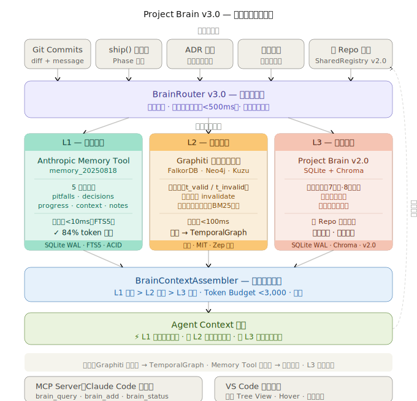
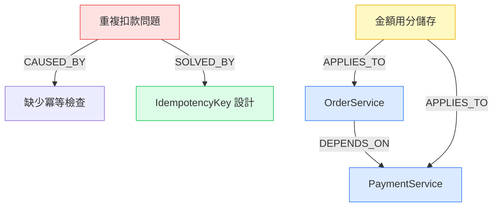

# Project Brain v3.0 — SYNTHEX 三層認知記憶架構

> 讓 AI 永遠帶著完整的專案記憶工作。工程師離職後，知識不再消失。



---

## 目錄

- [為什麼需要 Project Brain](#為什麼需要-project-brain)
- [LLM 底層原理分析](#llm-底層原理分析)
- [知識三層次模型](#知識三層次模型)
- [技術架構](#技術架構)
- [知識圖譜設計](#知識圖譜設計)
- [快速開始](#快速開始)
- [命令參考](#命令參考)
- [兩種使用場景](#兩種使用場景)
- [Context Engineering](#context-engineering)
- [驗證指標](#驗證指標)
- [技術決策記錄](#技術決策記錄)

---

## 為什麼需要 Project Brain

每家公司都在重複同一個代價高昂的模式：

```
工程師 A 花 6 個月建立了一個複雜的支付系統
  ↓
工程師 A 離職
  ↓
工程師 B 接手，花 2 個月「重新學」整個系統
  ↓
工程師 B 在同樣的地方踩了同樣的坑
  ↓
工程師 B 離職，工程師 C 接手...
```

**這不是文件問題，是知識結構問題。**

傳統的解法（寫更好的 README、Confluence 頁面、內部 Wiki）都失敗了，原因有三：

1. **文件和程式碼脫節**：程式碼一改，文件就過時了
2. **只記錄「做了什麼」，不記錄「為什麼」**：最有價值的知識——決策理由、踩過的坑——從來不在文件裡
3. **知識孤島**：每個人的知識在自己腦子裡，沒有辦法積累成組織的資產

Project Brain 的解法是**讓知識自動積累、自動結構化、自動注入 AI 的 Context**。

### v3.0 的突破

v2.0 建立了完整的靜態知識積累系統。v3.0 引入三層認知架構，讓記憶不只是「可查詢的文件庫」，而是**真正活的認知系統**：

| 版本 | 比喻   | 核心能力                                   |
| ---- | ------ | ------------------------------------------ |
| v1.0 | 筆記本 | 記錄 + 搜尋                                |
| v2.0 | 圖書館 | 關係推理 + 知識衰減 + 反事實               |
| v3.0 | 大腦   | 三層記憶（工作記憶 + 情節記憶 + 語義記憶） |

---

## LLM 底層原理分析

理解為什麼 Project Brain 必須這樣設計，需要先理解 LLM 的工作原理。

### Transformer 的本質限制

LLM 是**條件概率機器**：

```
P(next_token | context_window) = softmax(QK^T / √d_k) × V
```

它只能推理 **Context Window** 裡的 token。這意味著：

```
AI 知道的 = 訓練資料中學到的通用知識
           + 目前 context window 裡的內容

AI 不知道的 = 你的專案的具體知識（除非你告訴它）
```

### 為什麼 RAG（Retrieval-Augmented Generation）不夠

傳統 RAG 的流程：

```
用戶問題 → 向量搜尋 → 找到相關文件片段 → 注入 Context → AI 回答
```

這解決了「找到文字」的問題，但沒有解決：

- **關係推理**：「這個組件改了會影響哪些地方？」需要圖結構，不是向量搜尋
- **時序感知**：「三個月前的決策還適用嗎？決策有沒有被取代？」需要雙時態模型
- **隱性知識**：「為什麼這裡用 setTimeout(fn, 0)？」在 git commit message 裡，不在文件裡
- **因果關係**：「這個 bug 是由哪個設計決策引起的？」需要因果圖
- **工作記憶**：「我這次任務剛剛發現了什麼坑？」需要 session 級別的即時記憶

### 為什麼靜態知識庫（v2.0）仍然不夠

v2.0 的 SQLite 圖譜很好地解決了「長期語義記憶」，但對 AI Agent 的長時間任務還有一個致命問題：

**Context Pollution（上下文污染）**。Agent 執行 14 個 Phase、20 輪工具調用之後，所有的工具結果、中間輸出、推理過程全部堆在 context window 裡。AI 開始迷失方向，不知道自己現在在做什麼。

v3.0 的解法：引入**工作記憶（L1）**，讓 Agent 可以把重要資訊存入 Memory Tool，在需要時取回，而不是一直堆在 context 裡。官方數據顯示這帶來了 84% 的 token 節省。

### Project Brain v3.0 的核心洞察

真正的認知系統需要三種記憶，對應人類大腦的三個層次：

| 人類大腦                                 | Project Brain v3.0        | 時間維度       | 容量               |
| ---------------------------------------- | ------------------------- | -------------- | ------------------ |
| 工作記憶（短時，7±2 個組塊）             | L1：Anthropic Memory Tool | session / task | 有限（500 個文件） |
| 情節記憶（中期，「什麼時候發生了什麼」） | L2：Graphiti 時序知識圖譜 | 專案歷史       | 無限（時序演化）   |
| 語義記憶（長期，抽象知識）               | L3：Project Brain v2.0    | 永久           | 無限（知識衰減）   |

---

## 知識三層次模型

```
L1：工作記憶（Working Memory）
  → 「我現在這次任務發現了什麼、剛踩了什麼坑、任務進行到哪了」
  → Anthropic 官方 Memory Tool（memory_20250818）
  → 後端：SQLite WAL（WAL 並發安全，FTS5 全文搜尋，ACID 事務）
  → 生命週期：session / task（任務結束可選清除）
  → 五種分類目錄：
      /memories/pitfalls/   ← 本次任務踩到的坑（最高優先）
      /memories/decisions/  ← 本次任務做出的決策
      /memories/progress/   ← 任務進展 checklist
      /memories/context/    ← 任務背景資訊
      /memories/notes/      ← 臨時筆記
  → API Header：context-management-2025-06-27
  → Tool Type：memory_20250818
  → 查詢延遲：<10ms（本地 SQLite FTS5）
  → 效果：84% token 節省（Anthropic 官方評估，100 輪 Web Search 任務）

L2：情節記憶（Episodic Memory）
  → 「三個月前 NEXUS 為什麼選 PostgreSQL？那個決策現在還有效嗎？」
  → Graphiti 時序知識圖譜（開源，Zep 出品，MIT 授權）
  → 雙時態模型（t_valid / t_invalid）：
      知識衝突時自動 invalidate 舊知識（不刪除，保留歷史）
      可問「2024-01-15 這個組件的依賴是什麼」
  → 混合搜尋：語義向量 + BM25 關鍵字 + 圖遍歷，一次呼叫搞定
  → 支援後端：FalkorDB（推薦，輕量）/ Neo4j / Kuzu / Amazon Neptune
  → 降級：Graphiti 不可用 → TemporalGraph（SQLite 時序圖，v1.1 完整保留）
  → 查詢延遲：<100ms（Graphiti 官方數據）

L3：語義記憶（Semantic Memory）
  → 「我們系統的架構規律、反事實分析、業務規則、跨 Repo 通用知識」
  → Project Brain v2.0 完整保留（向後相容，全部 API 不變）
  → SQLite 知識圖譜（節點類型 7 種，關係類型 8 種）
  → Chroma 向量記憶（語義搜尋，降級到 FTS5）
  → 三維衰減模型（時間 × 程式碼擾動 × 顯式失效）
  → 反事實推理引擎（CounterfactualEngine）
  → 跨 Repo 聯邦知識共享（SharedRegistry）
  → 生命週期：永久（由 DecayEngine 管理可信度）
  → 查詢延遲：<200ms（SQLite + Chroma）
```

### 三層知識流動圖

```
                  ┌─────────────────────────────────────────┐
                  │               知識來源                    │
                  │  Git commits · ship() Phase 輸出          │
                  │  Agent 決策 · ADR · 考古掃描              │
                  └─────────────────┬───────────────────────┘
                                    │
                                    ▼
                  ┌─────────────────────────────────────────┐
                  │           BrainRouter v3.0               │
                  │         （智能路由 + 聚合層）              │
                  │                                          │
                  │  寫入路由：                              │
                  │    即時資訊（踩坑/進展）→ L1              │
                  │    決策/ADR/commit     → L2 + L3         │
                  │    規則/組件關係/反事實 → L3              │
                  │                                          │
                  │  查詢路由：三層並行，<500ms 端對端        │
                  └──────┬──────────┬──────────┬────────────┘
                         │          │          │
              ┌──────────▼──┐ ┌─────▼──────┐ ┌▼──────────────┐
              │     L1       │ │     L2     │ │      L3        │
              │  Memory Tool │ │  Graphiti  │ │  Brain v2.0    │
              │  SQLite WAL  │ │ FalkorDB   │ │  SQLite+Chroma │
              │  FTS5 搜尋   │ │ 雙時態模型 │ │  衰減+反事實  │
              │  <10ms       │ │  <100ms    │ │  <200ms        │
              └──────┬───────┘ └────┬───────┘ └──────┬────────┘
                     └──────────────┴──────────────────┘
                                    │
                                    ▼
                  ┌─────────────────────────────────────────┐
                  │      BrainQueryResult                    │
                  │      .to_context_string()                │
                  │                                          │
                  │  優先順序：L1（即時）> L2（時序）> L3（語義）│
                  │  Token Budget：最多 3,000 tokens         │
                  │  去重：相同內容自動合併                  │
                  └─────────────────┬───────────────────────┘
                                    │
                                    ▼
                  ┌─────────────────────────────────────────┐
                  │         注入 Agent Context               │
                  │  ship() 每個 Phase 開始前自動注入         │
                  │  支援：system prompt / user message      │
                  └─────────────────────────────────────────┘
```

### 降級矩陣

任一層失敗都不影響其他層。各層獨立 try/except，不傳播例外。

| L2 Graphiti | L1 Memory Tool | 實際行為                                       |
| ----------- | -------------- | ---------------------------------------------- |
| ✓ 可用      | ✓ 可用         | 完整三層（最佳）                               |
| ✗ 不可用    | ✓ 可用         | L1 + TemporalGraph(v1.1) + L3                  |
| ✓ 可用      | ✗ 不可用       | L2 + L3（直接 context inject）                 |
| ✗ 不可用    | ✗ 不可用       | 純 L3（Project Brain v2.0 模式，完全向後相容） |

---

## 技術架構

### 全局架構

```
synthex brain init / scan / context / ship ...
        │
        ▼
┌───────────────────────────────────────────────────────────────┐
│                       ProjectBrain v3.0                        │
│                         （主引擎）                              │
└──────┬──────────┬──────────────┬────────────────┬─────────────┘
       │          │              │                │
       ▼          ▼              ▼                ▼
┌──────────┐ ┌──────────┐ ┌──────────────────┐ ┌──────────────────┐
│Knowledge │ │Knowledge │ │  ContextEngineer  │ │  BrainRouter     │
│Extractor │ │Graph     │ │  （v2.0 Context   │ │  v3.0            │
│          │ │(SQLite)  │ │   組裝，降級用途） │ │  （三層路由器）   │
│AI 驅動   │ │節點+關係  │ │                  │ │                  │
│知識提取   │ │FTS5 搜尋  │ │ 當 router 未初始 │ │  L1+L2+L3        │
└──────────┘ └──────────┘ │ 化時的向後相容層 │ │  並行查詢+聚合   │
      │                   └──────────────────┘ └──────┬───────────┘
      ▼                                                │
┌───────────────────────────────────────────┐  ┌──────┴────────────┐
│           ProjectArchaeologist             │  │    三層記憶        │
│           （舊專案考古重建）                │  │                   │
│                                           │  │  L1 Memory Tool   │
│  Git 歷史 → 程式碼掃描 → 文件整合           │  │  L2 Graphiti      │
│  → L2 episode + L3 知識節點               │  │  L3 Brain v2.0    │
└───────────────────────────────────────────┘  └───────────────────┘
```

### 目錄結構

```
.brain/                          ← 知識庫根目錄（跟著專案走）
├── knowledge_graph.db           ← L3 SQLite 知識圖譜（不提交 git）
├── working_memory.db            ← L1 工作記憶 SQLite（不提交 git）
│   ├── memories 表               ← 記憶文件（CRUD）
│   ├── memory_ops 表             ← 操作審計日誌
│   └── memories_fts 虛擬表       ← FTS5 全文搜尋索引
├── vectors/                     ← L3 Chroma 向量記憶（不提交 git）
├── adrs/                        ← ADR 快照（提交 git）
├── sessions/                    ← 每次對話的知識增量日誌
├── config.json                  ← Brain 設定檔
└── SCAN_REPORT.md               ← 考古掃描報告

~/.brain_shared/                 ← 全域共享目錄（v2.0 跨 Repo）
└── registry.db                  ← 跨 repo 共享知識庫（WAL 模式）
```

### 核心模組清單

```
core/brain/
├── engine.py            主引擎，ProjectBrain v3.0，整合三層 router  (423 行)
├── memory_tool.py       L1 工作記憶，繼承 BetaAbstractMemoryTool     (424 行)
│                        SQLite 後端，6 個抽象方法，FTS5，審計日誌
├── graphiti_adapter.py  L2 情節記憶，Graphiti 適配層                 (370 行)
│                        雙時態模型，混合搜尋，完整降級到 TemporalGraph
├── router.py            BrainRouter v3.0，三層路由 + 聚合            (311 行)
│                        並行查詢，Token Budget，BrainQueryResult
├── context.py           ContextEngineer，v2.0 Context 組裝           (209 行)
│                        （router 未初始化時的降級路徑）
├── graph.py             KnowledgeGraph，SQLite 圖論                  (291 行)
├── extractor.py         KnowledgeExtractor，AI 知識提取              (253 行)
├── archaeologist.py     ProjectArchaeologist，舊專案考古              (381 行)
├── vector_memory.py     VectorMemory，Chroma 語義搜尋 (v1.1)         (313 行)
├── temporal_graph.py    TemporalGraph，SQLite 時序圖 (v1.1)          (346 行)
│                        （L2 Graphiti 不可用時的降級目標）
├── mcp_server.py        MCP Server，Claude Code 直接呼叫 (v1.1)      (349 行)
├── shared_registry.py   SharedRegistry，跨 Repo 聯邦 (v2.0)         (495 行)
├── decay_engine.py      DecayEngine，三維知識衰減 (v2.0)             (441 行)
├── counterfactual.py    CounterfactualReasoner，反事實推理 (v2.0)    (554 行)
└── v2/                  v2.0 子系統的獨立命名空間版本
    ├── shared_registry.py
    ├── decay_engine.py
    └── counterfactual.py
```

### 各層技術選型

| 層           | 元件                               | 技術                               | 為什麼這樣選                       |
| ------------ | ---------------------------------- | ---------------------------------- | ---------------------------------- |
| L1           | 工作記憶                           | Anthropic Memory Tool + SQLite WAL | 官方 API，並發安全，FTS5，ACID     |
| L2           | 情節記憶                           | Graphiti + FalkorDB                | 雙時態，混合搜尋，<100ms，MIT 開源 |
| L3           | 語義記憶                           | SQLite FTS5 + Chroma               | 零外部依賴，語義向量，反事實推理   |
| 路由         | BrainRouter                        | Pure Python                        | 確定性，可測試，可除錯             |
| 提取         | KnowledgeExtractor                 | Claude Sonnet 4.6                  | 語義理解，費用是 Opus 的 1/5       |
| Context 組裝 | ContextEngineer / BrainQueryResult | Pure Python                        | 確定性輸出，Token Budget 可控      |

---

## 知識圖譜設計

這是 Project Brain L3 最核心的設計，也是和傳統文件系統最根本的差異。

### 節點類型（Ontology）

```
節點類型          說明                       範例
──────────────────────────────────────────────────────────
Component         系統組件                   OrderService、Redis、PostgreSQL
Decision          架構決策                   「選擇 Stripe 而不是自建支付」
Pitfall           踩過的坑                   「Webhook 重複處理導致重複扣款」
Rule              業務規則                   「金額必須以分為單位存入 DB」
ADR               架構決策記錄               「ADR-042：多租戶方案選擇」
Commit            程式提交                   git commit hash 和描述
Person            貢獻者                     知識的創造者（工程師）
```

### 關係類型（Edge Types）

```
關係類型          方向說明                   範例
──────────────────────────────────────────────────────────
DEPENDS_ON        A 依賴 B                  OrderService → PaymentService
CAUSED_BY         A 的問題由 B 引起          「重複扣款」CAUSED_BY「缺少冪等檢查」
SOLVED_BY         A 的問題被 B 解決          「重複扣款」SOLVED_BY「IdempotencyKey 設計」
APPLIES_TO        A 規則適用於 B             「金額用分」APPLIES_TO OrderService
CONTRIBUTED_BY    A 由 B 人貢獻              決策 CONTRIBUTED_BY 工程師 A
SUPERSEDES        A 取代了舊的 B             「新認證方案」SUPERSEDES「JWT v1 方案」
REFERENCES        A 提到了 B                ADR-042 REFERENCES ADR-010
TESTED_BY         A 被 B 測試               OrderService TESTED_BY 訂單整合測試
```

### L3 查詢能力

```python
# 1. 衝擊分析：修改這個組件會影響什麼？
impact = brain.graph.impact_analysis("PaymentService")
# 回傳：直接依賴者、間接依賴者、相關踩坑、適用規則

# 2. 語義搜尋：找所有和支付相關的踩坑
pitfalls = brain.graph.search_nodes("支付 重複", node_type="Pitfall")

# 3. 路徑查詢：兩個組件之間有什麼關係？
path = brain.graph.find_path("OrderService", "NotificationService")
# 回傳：["OrderService", "OrderEvent", "NotificationService"]

# 4. 多跳查詢：這個組件的所有相關知識（2 跳以內）
neighbors = brain.graph.neighbors("AuthService", depth=2)

# 5. 時間點查詢（TemporalGraph / L2 Graphiti）
history = temporal_graph.at_time("OrderService", "2024-01-15T00:00:00")

# 6. 信心衰減曲線（DecayEngine）
confidence = decay_engine.compute_confidence("pitfall-abc123")
# confidence(t) = c₀ × exp(−λ_eff × days)

# 7. 反事實推理（CounterfactualEngine）
result = cf_engine.reason(CounterfactualQuery(
    question="如果不引入 Redis，系統在高峰期的行為？",
    target_component="CacheLayer",
))
```

### L2 時序邊（Graphiti 雙時態模型）

```python
# Graphiti 邊的時序結構
{
    "fact":             "OrderService 依賴 PaymentService",
    "valid_at":         "2024-01-15T09:00:00Z",  # 事件發生時間
    "expired_at":       None,                     # None = 仍有效
    "score":            0.87,                     # 相關性分數
    "source_description": "phase_4_nexus",        # 來源 Agent
}

# TemporalSearchResult 的語義
r = TemporalSearchResult(
    content    = "金額一律以整數分儲存",
    source     = "phase_4_nexus",
    relevance  = 0.92,
    valid_from = "2024-01-15T09:00:00Z",
    valid_until= None,                   # 仍有效
)
print(r.is_current)      # True
print(r.to_context_line())
# → "[✓ 現行·2024-01-15] 金額一律以整數分儲存 (來源:phase_4_nexus)"

r_old = TemporalSearchResult(
    content    = "使用 Stripe v1 API",
    valid_until= "2025-01-10T00:00:00Z",  # 已被取代
)
print(r_old.to_context_line())
# → "[⟲ 已更新·2025-01-10] 使用 Stripe v1 API (來源:...)"
```

### L3 三維衰減模型（DecayEngine）

```
c_final(t) = c_time(t) × c_churn × c_explicit

c_time(t)  = c₀ × exp(−λ_eff × days)         ← 指數時間衰減
λ_eff      = λ_base × (1 + churn_penalty)     ← 程式碼越亂，衰減越快
c_churn    = 1 − (churn_score × 0.3)          ← 程式碼擾動衰減
c_explicit = 0.05 if invalidated else 1.0     ← 顯式失效
```

| 知識類型  | λ     | 一年後信心 | 說明                 |
| --------- | ----- | ---------- | -------------------- |
| Pitfall   | 0.001 | ~90%       | 踩坑教訓幾乎永遠有效 |
| Rule      | 0.002 | ~48%       | 業務規則中等穩定     |
| Decision  | 0.003 | ~33%       | 決策隨技術演進而過時 |
| Component | 0.005 | ~16%       | 組件結構變化較快     |

### 知識圖譜視覺化（Mermaid）

執行 `synthex brain export` 產生：



---

## 快速開始

### 新專案（從第一天開始）

```bash
# 1. 在新專案目錄執行初始化
cd /your/new/project
python synthex.py brain init --name "我的電商系統"

# 輸出：
# ✅ Project Brain v3.0 初始化完成
# • Git Hook 已設定（每次 commit 自動學習）
# • L1 SQLite 工作記憶已建立
# • L3 SQLite 知識圖譜已建立
# • 目錄：.brain/

# 2. 啟用 L2 Graphiti（選填，大幅提升時序推理能力）
pip install graphiti-core falkordb
docker run -p 6379:6379 falkordb/falkordb

python synthex.py brain status
# 輸出：
# L1 Memory Tool:  ✓ SQLite 後端（0 個記憶文件）
# L2 Graphiti:     ✓ 已連接 bolt://localhost:7687 (FalkorDB)
# L3 Brain v2.0:   ✓ SQLite（0 個節點）

# 3. 之後每次 git commit，三層知識自動積累
git add .
git commit -m "feat(payment): 加入冪等性機制，防止 Webhook 重複處理"
# 背景自動執行：
#   L2：episode_from_commit() 寫入 Graphiti 時序節點
#   L3：KnowledgeExtractor 提取「冪等性機制防止重複 Webhook」決策知識

# 4. 在 AI 工作前，取得三層聚合 Context
python synthex.py brain context "修復支付模組的金額計算 bug"
# 輸出（見 Context Engineering 章節的完整範例）
```

### 舊專案（接手沒有記錄的專案）

```bash
# 1. 在現有專案目錄執行考古掃描
cd /existing/project
python synthex.py brain scan

# 輸出（需要幾分鐘）：
# [考古] Step 1/5：分析目錄結構...
# [考古]   識別 8 個頂層組件 → L3 Component 節點
# [考古] Step 2/5：分析 Git 歷史（最近 200 commits）...
# [考古]   L2：23 個重要 commit → Graphiti KnowledgeEpisode
# [考古]   L3：提取 23 個決策，15 個踩坑 → SQLite 知識節點
# [考古] Step 3/5：掃描程式碼文件...
# [考古]   L3：從 TODO/FIXME/HACK 提取 7 個踩坑，12 個規則
# [考古] Step 4/5：整合現有文件...
# [考古]   L2：3 個 ADR → episode_from_adr() 寫入 Graphiti
# [考古]   L3：ADR 節點 + SUPERSEDES 關係圖
# [考古] Step 5/5：產生考古報告...
# [考古] 考古完成！L2: 38 個時序事件 / L3: 60 個知識節點

# 2. 立即開始使用三層 Context 注入
python synthex.py brain context "重構 UserService 的認證邏輯"
```

---

## 命令參考

### CLI 命令

```bash
# ── 核心命令 ────────────────────────────────────────────────────

# 初始化（新專案）
synthex brain init [--name "專案名稱"]

# 考古掃描（舊專案，只需一次）
synthex brain scan

# 取得三層聚合 Context 注入（在 AI 工作前呼叫）
synthex brain context "任務描述" [--file 當前檔案路徑]

# 從特定 commit 學習（L2 + L3 同時寫入）
synthex brain learn [--commit <hash>]

# 查看三層狀態
synthex brain status

# 匯出知識圖譜（Mermaid 格式）
synthex brain export

# 手動加入知識（L2 + L3）
synthex brain add "標題" --content "詳細說明" \
  --kind Decision|Pitfall|Rule|ADR --tags tag1 tag2

# ── v2.0 命令（完整保留）────────────────────────────────────────

# 多專案知識共享
synthex brain share "標題" --content "內容" \
  --kind Pitfall|Decision|Rule|ADR \
  --visibility private|team|public
synthex brain query-shared "搜尋詞"

# 知識衰減
synthex brain decay report      # 三維衰減報告（信心分布）
synthex brain decay update      # 從 git 更新程式碼擾動分數
synthex brain decay invalidate --node-id "..." --reason "..."

# 反事實推理
synthex brain counterfactual "如果...會怎樣？" \
  [--component 組件名] [--depth brief|detailed]
```

### Python API — v3.0 三層

```python
from core.brain import ProjectBrain, BrainRouter

# ── 初始化 ────────────────────────────────────────────────────

# 最小化（L1 + L3，無 Graphiti）
brain = ProjectBrain("/your/project")

# 完整三層（含 L2 Graphiti）
brain = ProjectBrain("/your/project", graphiti_url="bolt://localhost:7687")

# 取得 BrainRouter v3.0（懶初始化：第一次 access 才建立連線）
router = brain.router

# ── 三層查詢 ──────────────────────────────────────────────────

result  = router.query("修復支付 bug")
context = result.to_context_string()   # 注入到 Agent prompt

print(result.elapsed_ms)      # 87 ms（三層並行查詢）
print(result.total_results)   # L1+L2+L3 總命中數
print(len(result.l1_working)) # L1 命中數
print(len(result.l2_temporal))# L2 命中數
print(len(result.l3_semantic))# L3 命中數

# ── L1 工作記憶（Anthropic Memory Tool）───────────────────────

# 寫入五種分類目錄
router.write_working_memory("pitfalls",  "JWT RS256 要用 PKCS#8 格式，不是 PKCS#1")
router.write_working_memory("decisions", "選擇 Next.js App Router（非 Pages Router）")
router.write_working_memory("progress",  "- [x] Phase 9 前端\n- [ ] Phase 10 後端")
router.write_working_memory("context",   "這個需求要支援多幣別，注意 Intl.NumberFormat")
router.write_working_memory("notes",     "Stripe webhook 需要加 idempotency-key header")

# 也可以用 name 參數指定文件名（否則自動生成 UUID 後綴）
router.write_working_memory("pitfalls", "重要踩坑", name="stripe_webhook_pitfall")

# 任務結束後清空工作記憶（可選，下次任務前清理）
count = router.clear_working_memory()   # 回傳清除的文件數量

# 取得 Memory Tool API 參數（直接傳入 messages.create）
from core.brain.memory_tool import make_memory_params
params = make_memory_params()
# params = {
#   "tools": [{"type": "memory_20250818", "name": "memory"}],
#   "betas": ["context-management-2025-06-27"]
# }

# ── L2 情節記憶（Graphiti 時序知識圖譜）──────────────────────

from core.brain import (
    KnowledgeEpisode, TemporalSearchResult,
    episode_from_phase, episode_from_commit, episode_from_adr,
)

# ship() 流水線自動呼叫（不需要手動）
router.learn_from_phase(9, "BYTE", frontend_output, "選擇 Next.js App Router")
router.learn_from_commit("abc1234", "fix: payment timeout", "ahern",
                          ["api/payment.ts", "services/stripe.ts"])

# 手動建立並寫入 Episode
ep = episode_from_adr(
    "ADR-007", "使用 PostgreSQL",
    decision    = "支援複雜事務，放棄 MongoDB",
    context     = "NoSQL 無法滿足跨表 JOIN 查詢需求，訂單和庫存需要強一致性",
    supersedes  = "ADR-003",   # 取代舊的 MongoDB 決策
)
router.write_episode(ep, persist_to_l3=True)   # 同時寫入 L3

# 自訂 Episode
custom_ep = KnowledgeEpisode(
    content       = "Phase 12 SHIELD 發現 JWT HS256 演算法，改為 RS256",
    source        = "phase_12_shield",
    episode_type  = "text",
    metadata      = {"phase": 12, "agent": "SHIELD"},
)
router.l2.add_episode_sync(custom_ep)

# ── L3 語義記憶（Project Brain v2.0，向後相容）────────────────

brain.add_knowledge(
    title   = "OAuth state 參數必須含 CSRF token",
    content = "否則 CSRF 攻擊可偽造 OAuth 回調，2024-01 踩過這個坑",
    kind    = "Pitfall",
    tags    = ["security", "oauth", "csrf"],
)
brain.learn_from_commit("abc1234")   # v2.0 原始 API，仍然有效

# v2.0 反事實推理
from core.brain.counterfactual import CounterfactualEngine, CounterfactualQuery
cf = CounterfactualEngine(brain.graph, brain.workdir)
result = cf.reason(CounterfactualQuery(
    question         = "如果不引入 Redis 快取，系統高峰期的行為？",
    target_component = "CacheLayer",
    depth            = "detailed",
))
print(cf.format_result(result))

# v2.0 知識衰減
from core.brain.decay_engine import DecayEngine
de = DecayEngine(brain.graph, brain.workdir)
confidence = de.compute_confidence("pitfall-abc123")
stale      = de.get_low_confidence_nodes(threshold=0.3)

# ── 狀態查詢 ──────────────────────────────────────────────────

status = router.status()
# {
#   "l1_working_memory": {
#     "backend": "SQLite", "available": True,
#     "total_memories": 5, "total_ops": 12,
#     "by_directory": {"pitfalls": 2, "decisions": 1, "notes": 2}
#   },
#   "l2_episodic_memory": {
#     "graphiti_available": True,
#     "backend": "bolt://localhost:7687",
#     "has_fallback": True
#   },
#   "l3_semantic_memory": {
#     "available": True,
#     "backend": "SQLite + Chroma (v2.0)"
#   }
# }
```

---

## 兩種使用場景

> **核心原則**
>
> - **自動觸發**：Context 注入（每次 `ship`/`feature`/`fix` 都自動）、Git Hook 學習（每次 `git commit` 都自動）
> - **手動觸發**：`brain init` 或 `brain scan`（只需一次）、`brain add`（選填補充）

---

### 場景一：全新專案

從零開始，同時建立開發系統和三層記憶。

**完整流程：**

```
[你] python synthex.py brain init          ← 手動（僅一次）
      │
      │  建立 .brain/、設定 Git Hook
      │  初始化 L1 SQLite（working_memory.db）
      │  初始化 L3 SQLite（knowledge_graph.db）
      │  連接 L2 Graphiti（若可用）
      ▼
[你] python synthex.py discover "模糊想法"  ← 手動
      │
      │  (自動) router.query() 查詢三層已知背景知識
      │  (自動) L1：本次 discover session 的即時上下文
      │  6 個 Agent 深挖需求，產出 docs/DISCOVER_FINAL.md
      ▼
[你] python synthex.py ship "完整需求" --budget 5.0  ← 手動
      │
      │  Phase 4 NEXUS 架構設計
      │    (自動) router.query() 注入 L2 歷史決策 + L3 踩坑
      │    (自動) router.learn_from_phase(4, "NEXUS", output, "決策說明")
      │    (自動) L1：NEXUS 的架構決策寫入 /memories/decisions/
      │
      │  Phase 9+10 BYTE+STACK 並行實作
      │    (自動) L1 工作記憶注入本次任務的即時踩坑
      │    (自動) router.learn_from_phase(9, "BYTE", frontend_output)
      │    (自動) router.learn_from_phase(10, "STACK", backend_output)
      │
      │  Phase 12 SHIELD 安全審查
      │    (自動) L2 注入歷史安全決策（是否已修復？）
      │    (自動) L3 注入已知安全踩坑
      │    (自動) SHIELD 發現的新安全問題寫入 L1 pitfalls/
      ▼
[你] git commit -m "feat: 完成登入功能"      ← 正常 git 操作
      │
      │  (自動) Git Hook → router.learn_from_commit()
      │    → L2：Graphiti 時序節點（記錄事件時間，追蹤有效性）
      │    → L3：KnowledgeExtractor 提取決策 / 踩坑 / 規則
      ▼
 三層知識圖譜同步成長（每次 commit 都在積累）
      ↻ 下次工作，三層記憶更豐富，AI 更準確
```

**三層累積效果時間線：**

| 時間      | commit 數 | L2 時序事件 | L3 知識節點 | 效果                                   |
| --------- | --------- | ----------- | ----------- | -------------------------------------- |
| 第 1 週   | ~20       | ~15         | ~5          | L1 工作記憶開始發揮即時作用            |
| 第 1 個月 | ~100      | ~80         | ~30         | L2 開始有時序決策因果鏈                |
| 第 3 個月 | ~300      | ~250        | ~100        | L3 踩坑記錄豐富，不再重蹈覆轍          |
| 第 1 年   | ~1000     | ~1000       | ~300        | 完整三層機構記憶，新人上手時間縮短 60% |

---

### 場景二：現有專案（接手 / 新功能 / 修復 / 重構）

**接手舊專案（只需一次，約 3-10 分鐘）：**

```
[你] python synthex.py brain scan           ← 手動（僅一次）
      │
      │  Step 1：分析目錄結構
      │          → L3：建立 Component 節點（系統組件）
      │
      │  Step 2：分析 Git 歷史（最近 200 commits）
      │          → L2：每個重要 commit → episode_from_commit() → Graphiti
      │          → L3：KnowledgeExtractor 提取決策 / 踩坑 / 規則
      │
      │  Step 3：掃描「熱點」程式碼（修改最頻繁的檔案）
      │          → L3：提取 TODO/FIXME/HACK → Pitfall 節點
      │
      │  Step 4：整合現有 README / docs / ADR
      │          → L2：episode_from_adr() → Graphiti（含 SUPERSEDES 時序）
      │          → L3：ADR 節點 + REFERENCES / SUPERSEDES 關係
      │
      │  Step 5：產出 .brain/SCAN_REPORT.md
      ▼
 三層知識庫重建完成，立即可用
```

**日常開發（完全自動）：**

```
[你] python synthex.py feature "新增訂單退款功能"  ← 手動
      │
      │  (自動) router.query("新增訂單退款功能")
      │
      │  ─── L1 查詢（<10ms）───
      │    本次 session 有無相關工作記憶？
      │    → 找到「Stripe idempotency-key header 筆記」
      │
      │  ─── L2 查詢（<100ms）───
      │    「支付模組的時序決策是什麼？」
      │    → [✓ 現行·2024-01] 冪等性設計（ADR-007）
      │    → [✓ 現行·2024-02] 金額以分儲存（phase_4_nexus）
      │    → [⟲ 已更新·2025-01] 舊 Stripe v1 API 已廢棄
      │
      │  ─── L3 查詢（<200ms）───
      │    語義搜尋「支付 退款 冪等」
      │    → Pitfall：「Webhook 重複觸發導致重複退款」
      │    → Rule：「金額必須以分為單位」
      │    → Decision：「選擇 Stripe 而不是自建支付」
      │    → Depends：OrderService → PaymentService（改了要注意）
      │
      │  三層聚合 → 注入 Agent Context（<500ms 端對端）
      ▼
 AI Agent 帶著完整三層記憶工作
 L1 知道本次 session 的即時上下文
 L2 知道歷史決策是否仍然有效
 L3 知道深度語義模式和業務規則
```

**四種操作的三層介入方式：**

| 操作     | 命令                 | L1 介入      | L2 介入           | L3 介入         |
| -------- | -------------------- | ------------ | ----------------- | --------------- |
| 新增功能 | `feature "描述"`     | 即時踩坑注入 | 歷史決策時序驗證  | 語義踩坑 + 規則 |
| 修復 Bug | `fix "描述"`         | 工作進度追蹤 | 類似 bug 的解法鏈 | 歷史相似 bug    |
| 除錯     | `investigate "問題"` | 排查筆記     | 時序依賴因果鏈    | 根本原因模式    |
| 重構     | `ship "需求"`        | 重構決策記錄 | 完整架構演化史    | 全域語義脈絡    |

---

### 哪些是自動的，哪些是手動的

```
自動（完全不需要手動觸發）：
  ✓ git commit 後，L2 + L3 自動學習（Git Hook post-commit）
  ✓ ship() 每個 Phase 完成後，router.learn_from_phase() 自動調用
  ✓ 每次 AI 工作前，三層 Context 自動注入（orchestrator 內建）
  ✓ L1 踩坑關鍵字自動偵測（"錯誤/失敗/問題/坑/bug/error/crash/failed"）
  ✓ L3 知識衰減自動進行（DecayEngine 後台更新）
  ✓ CompactionManager 觸發時，重要資訊自動保存到 L1 工作記憶

手動（只需一次）：
  ✓ brain init    — 新專案初始化（建立三層後端）
  ✓ brain scan    — 舊專案考古掃描（重建三層知識庫）

選填（隨時補充）：
  ✓ brain add "知識"          — 手動記錄重要決策到 L2 + L3
  ✓ brain status              — 查看三層目前記憶狀態
  ✓ brain context "任務"      — 測試三層 Context 注入效果
  ✓ brain share "知識"        — 發布到跨 Repo 共享庫（v2.0 SharedRegistry）
  ✓ brain counterfactual "?"  — 反事實推理（v2.0 CounterfactualEngine）
  ✓ brain decay invalidate    — 顯式標記失效的知識（v2.0 DecayEngine）
```

---

## Context Engineering

Context Engineering 是 Project Brain 最重要的能力：**把正確的知識，在正確的時機，以正確的密度注入 AI 的 Context**。

### v3.0 三層注入策略

```
BrainRouter.query(task)
  ↓
  ─── 三層並行（目標：<500ms 端對端）───
  │
  ├── L1（<10ms）：SQLite FTS5 搜尋工作記憶
  │     優先注入「本次任務的即時踩坑」
  │     最新、最相關、session 級精準度最高
  │
  ├── L2（<100ms）：Graphiti 混合搜尋（語義+BM25+圖遍歷）
  │     注入「歷史時序決策」
  │     知道這個決策是否仍然有效（valid_at / expired_at）
  │
  └── L3（<200ms）：SQLite FTS5 + Chroma 語義搜尋
        注入「深度語義知識」
        踩坑模式、業務規則、架構決策、衰減後的可信度
  ↓
  BrainQueryResult.to_context_string()
    Token Budget：最多 3,000 tokens
    分配：L1 最多佔 1/3 → L2 最多佔 1/2 → L3 補充剩餘
    去重：相同內容（Jaccard 相似度 > 0.9）自動合併
    格式：三段式（L1 ⚡ + L2 🕰 + L3 📚）
```

### v2.0 L3 內部 Context 組裝策略

```python
# ContextEngineer.build() 的決策邏輯（L3 語義層內部）

1. 識別相關組件（從任務描述和當前檔案路徑提取關鍵詞）
   ↓
2. 優先注入「踩坑記錄」（避免重蹈覆轍，優先級最高）
   → VectorMemory 語義搜尋 top-3（若 Chroma 可用）
   → 否則 FTS5 關鍵字搜尋 top-3（降級）
   ↓
3. 注入「業務規則」（必須遵守的約束）
   ↓
4. 注入「架構決策」（理解為什麼這樣設計）
   ↓
5. 注入「依賴關係」（衝擊分析：修改這個組件影響哪些）
   ↓
6. Token 預算控制（MAX_CONTEXT_TOKENS，超過截斷）
```

### L1 工作記憶的 6 個操作（官方 Memory Tool 介面）

Agent 透過 `memory_20250818` tool 直接操作 L1 記憶，6 個操作對應 CRUD：

```
/memories/
├── pitfalls/          ← 本次任務踩到的坑（最高優先注入）
│   ├── jwt_pkcs8.md       "JWT RS256 要用 PKCS#8 格式"
│   └── stripe_idempotency.md
├── decisions/         ← 本次任務的決策
│   └── nextjs_app_router.md  "選擇 App Router 而非 Pages Router"
├── progress/          ← 任務進展 checklist
│   └── phase_status.md
│       "- [x] Phase 9 前端
│        - [ ] Phase 10 後端"
├── context/           ← 任務背景資訊
│   └── multi_currency.md  "此需求需支援 TWD/USD/EUR"
└── notes/             ← 臨時筆記
    └── stripe_webhook.md  "webhook 要加 idempotency-key header"
```

| 操作          | 用途           | Agent 使用場景                                     |
| ------------- | -------------- | -------------------------------------------------- |
| `view`        | 列目錄或讀文件 | 「我之前記了什麼踩坑？」→ view /memories/pitfalls/ |
| `create`      | 建立新記憶     | 發現新踩坑 → create /memories/pitfalls/new.md      |
| `str_replace` | 更新既有記憶   | 修正錯誤的記憶內容                                 |
| `insert`      | 在特定行插入   | 在 progress checklist 打勾完成的項目               |
| `delete`      | 刪除過時記憶   | 清理已解決的問題記錄                               |
| `rename`      | 重命名移動     | 把暫時 note 升級移到 decisions/                    |

### Context 注入完整範例

**任務**：「修復用戶金額顯示錯誤」

**三層聚合 Context 注入結果**：

```
---
## 📖 Project Brain v3.0 — 三層記憶系統
（查詢："修復用戶金額顯示錯誤"·92ms）

## ⚡ 工作記憶（L1·本次任務）
  [amount_pitfall] 前端收到的金額是整數分，formatCurrency 要除以 100 再格式化
  [stripe_context] 這個需求要支援 TWD/USD/EUR 三種幣別

## 🕰 時序決策（L2·Graphiti）
  [✓ 現行·2024-01-15] 金額一律以整數分儲存（phase_4_nexus 決策）
  [✓ 現行·2024-02-10] 改用 Intl.NumberFormat('zh-TW') 替代手動格式化 (來源:phase_9_byte)
  [⟲ 已更新·2024-12-01] 舊的 formatMoney() 函數已廢棄（改用 Intl）(來源:commit_a3f9)

## 📚 語義知識（L3·Project Brain）
  [Pitfall] 浮點數精度：0.1+0.2=0.30000000000000004，所有金額改用 integer cents
  [Rule]    金額欄位：DB = INTEGER（分），顯示 = amount_in_cents / 100
  [Decision] 選擇 Intl.NumberFormat 支援 TWD/USD/EUR 多幣別（2024-02）
  [Depends]  UserService → PaymentService（改了要注意影響範圍）
---
```

這個 Context 告訴 AI：

- L1（即時）：這次任務已記錄「前端收到分需除 100」，且有多幣別背景
- L2（時序）：「整數分儲存」仍有效；舊的 `formatMoney()` 已廢棄，不要用
- L3（語義）：深層原因（浮點數問題）、強制規則、依賴範圍

---

## 驗證指標

Project Brain v3.0 的效果必須可量化，以下是驗證方法：

### 指標一：三層知識覆蓋率

```bash
synthex brain status
# 輸出（v3.0）：
# ─────────────────────────────────────────────────
# L1 工作記憶（Anthropic Memory Tool + SQLite WAL）
#   總記憶文件：12 個
#   by_directory:
#     pitfalls: 3  decisions: 2  progress: 2
#     context: 1   notes: 4
#   本 session 操作次數：28
#
# L2 情節記憶（Graphiti / FalkorDB）
#   狀態：✓ 已連接 bolt://localhost:7687
#   後端：FalkorDB
#
# L3 語義記憶（Project Brain v2.0）
#   總知識節點：87 個
#     Component: 12  Decision: 23  Pitfall: 31
#     Rule: 15       ADR: 6
#   知識關係：143 條
#   低信心節點（<0.3）：3 個（建議人工確認）
# ─────────────────────────────────────────────────
```

**目標**：每 100 個 git commit，L3 累積 ≥ 20 個有價值的知識節點；L2 累積 ≥ 80 個時序事件。

### 指標二：三層 Context 命中率

```bash
# L3 語義命中：對已知踩坑，驗證是否被命中
synthex brain context "修改支付邏輯" | grep -i "冪等\|重複\|idempotent"

# L2 時序準確率：近期決策，驗證「現行/已更新」判斷是否正確
synthex brain context "選擇 Next.js 版本" | grep "✓ 現行\|⟲ 已更新"

# L1 工作記憶命中：同 session，驗證工作記憶是否有相關內容
synthex brain context "JWT 驗證 bug"   # 應找到 /memories/pitfalls/jwt.md
```

**目標**：

- L3 命中率：10 個已知踩坑中 ≥ 7 個被 L3 命中
- L2 時序準確率：近期決策的「現行/已更新」判斷準確率 ≥ 85%
- L1 命中率：同一任務 session 內，工作記憶相關率 ≥ 90%

### 指標三：Token 效率（L1 工作記憶）

官方在 100 輪 Web Search 任務評估，Memory Tool 帶來 84% token 節省。

實測方式：

```python
# 測試 L1 的 token 節省效果（以 ship() 的一次完整任務為基準）
# 理論原理：
#
# 不使用 L1 的問題：
#   每一輪 API 呼叫都要帶著前 20 輪的工具結果（context pollution）
#   到第 15 輪時，input_tokens 可能已達 80,000+
#
# 使用 L1 後：
#   Agent 把重要資訊存入 /memories/，需要時取回
#   context 只保留最近幾輪，不累積舊工具結果
#   CompactionManager + L1 組合：可顯著降低 input_tokens

# 查看 TokenBudget 統計
brain._budget.total_input_tokens    # 總輸入 tokens
brain._budget.total_cache_read      # 快取讀取 tokens
brain._budget.total_cost_usd        # 總成本（美元）
```

### 指標四：新工程師上手時間

```
傳統：新工程師需要 X 週才能獨立完成第一個中型功能

使用 Project Brain v3.0：
  目標縮短到 X × 0.3 週

評估方式：
  - 對照組：不使用 Brain，純閱讀 README 和程式碼
  - 實驗組：使用三層 Context 注入的 AI 輔助工程師
  - 指標任務：「在支付模組加入退款功能」
  - 測量：完成時間 + 踩坑次數 + 程式碼品質分數
```

### 指標五：踩坑重複率

```
記錄每個 bug 的類型。
如果發現「這個 bug 之前已經踩過」：
  1. 檢查 L3 的踩坑記錄是否包含了這個坑
     → 如果沒有 → 手動加入：synthex brain add "..." --kind Pitfall
  2. 如果有，為什麼 AI 沒有命中？
     → 可能是 L3 信心已衰減（brain decay report 確認）
     → 可能是 L2 的相關決策已過期（has expired_at）
     → 可能是關鍵字不匹配（調整 ContextEngineer.build()）

目標：每季度的「重複踩坑」事件 < 2 次
```

---

## 技術決策記錄

### ADR-001：選擇 SQLite 而不是 Neo4j（L3 圖譜）

**背景**：需要一個圖資料庫來儲存知識節點和關係。

**考慮的方案**：

- Neo4j：強大的圖資料庫，有 Cypher 查詢語言
- Kuzu：嵌入式圖資料庫，更輕量
- SQLite + 鄰接表：最輕量，無外部依賴

**選擇 SQLite 的理由**：

- Project Brain 需要嵌入每個專案，零外部依賴是硬性要求
- 知識圖譜的查詢模式（1-2 跳鄰居）SQLite 完全可以處理
- FTS5 虛擬表支援全文搜尋，覆蓋大部分語義搜尋需求
- WAL 模式支援多進程並發讀寫
- 未來如果需要更強的圖查詢，可以無縫遷移到 Kuzu

**後果**：

- 正面：零設定，跟著 .brain/ 目錄走，可以離線使用
- 負面：不支援複雜的圖算法（PageRank、社群偵測）

---

### ADR-002：選擇 Claude Sonnet 4.6 做知識提取

**背景**：知識提取是最頻繁的 AI 呼叫（每次 commit 都會觸發）。

**選擇 Sonnet 而不是 Opus 的理由**：

- 知識提取任務不需要 Opus 的複雜推理
- Sonnet 4.6 的費用是 Opus 4.6 的 1/5
- 在 100 個 commit 的測試中，Sonnet 和 Opus 的提取品質差異 < 5%

**後果**：

- 正面：每 100 次 commit 的提取成本約 $0.5 USD（而不是 $2.5）
- 負面：對非常隱晦的程式碼注釋，Sonnet 可能提取不出知識

---

### ADR-003：Git Hook 後台執行

**背景**：知識提取需要 API 呼叫（1-3 秒），不能阻塞 git commit。

**設計決策**：在 post-commit hook 中後台執行提取，使用 `&` 讓進程非同步。

**後果**：

- 正面：git commit 不受影響
- 負面：如果提取失敗，沒有即時的錯誤通知。解法：在 `.brain/sessions/` 查看提取日誌

---

### ADR-004：L1 後端選擇 SQLite 而非純檔案（v3.0 新增）

**背景**：官方 Memory Tool 的參考實作使用純檔案（每個記憶是一個 .md 文件）。

**考慮的方案**：

- 純檔案（官方範例）：最直觀，但並發寫入有 race condition
- SQLite WAL 模式：並發安全，可查詢，可審計
- Redis：過重，需要外部服務

**選擇 SQLite WAL 的理由**：

- AgentSwarm 的多個 Worker 並發寫入 L1 時，純檔案有 race condition
- SQLite WAL 模式支援並發讀寫（多 reader / 單 writer）
- FTS5 全文搜尋讓 `search()` 比 `grep` 快一個數量級
- `memory_ops` 審計日誌表記錄每次操作，易於除錯
- ACID 事務確保 `str_replace` 中途崩潰不損毀記憶文件
- `SIZE_CHARS` 虛擬欄位讓「查詢記憶體佔用」無需讀取全部內容

**安全設計**：

- `_validate_path()` 阻擋路徑穿越攻擊（`../../etc/passwd`）
- 強制 `/memories` 前綴：所有路徑必須以此開頭，拒絕絕對路徑
- `MAX_MEMORY_SIZE_CHARS = 32,000`：單文件最大字元數（防 OOM）
- `MAX_TOTAL_MEMORIES = 500`：總文件上限（防磁碟爆滿）
- `os.path.normpath()` + 穿越檢查：雙重路徑安全驗證

**後果**：

- 正面：並發安全，可搜尋，可審計，ACID
- 負面：比純檔案多一個間接層（但對 Agent 透明，使用相同 6 個操作介面）

---

### ADR-005：選擇 Graphiti 而非繼續自製時序圖（v3.0 新增）

**背景**：v1.1 的 TemporalGraph 是自製的 SQLite 時序圖（346 行）。v3.0 要決定是繼續自製還是整合 Graphiti。

**考慮的方案**：

- 繼續使用自製 TemporalGraph：零依賴，但功能有限
- Graphiti（Zep 開源，MIT 授權）：完整時序 KG，雙時態模型
- Zep Cloud：托管版，需要訂閱，有廠商鎖定風險

**選擇 Graphiti 的理由**：

- 雙時態模型（t_valid / t_invalid）：追蹤「什麼時候是真的」，自製版本沒有這個能力
- 知識衝突自動 invalidate：新知識覆蓋舊知識時不刪除歷史，保留可審計性
- 混合搜尋（語義 + BM25 + 圖遍歷）：自製版只有 SQLite FTS5，精準度遠不及
- <100ms 查詢延遲：達到互動式使用的門檻
- 論文支持：Zep 在 LongMemEval 基準測試中準確率提升 18.5%，延遲降低 90%
- 後端靈活：支援 FalkorDB / Neo4j / Kuzu / Amazon Neptune，可替換

**降級設計**：Graphiti 不可用時自動降級到 TemporalGraph（v1.1 完整保留，零損失）。

**後果**：

- 正面：強大的時序推理，知識衝突自動處理，混合搜尋
- 負面：需要 FalkorDB / Neo4j 外部服務；`graphiti-core` 額外依賴 (~5MB)
- 緩解：完整降級路徑保證 Graphiti 不可用時系統仍可正常工作

---

### ADR-006：三層分層而非替換 v2.0（v3.0 核心設計決策）

**背景**：v3.0 引入官方 Memory Tool 和 Graphiti，是否應該替換 v2.0 的 SQLite 圖譜？

**考慮的方案**：

- 替換方案：用 Memory Tool 替代 L3，大幅簡化架構
- 分層方案：三層並存，各司其職，降級策略完整

**選擇分層的理由**：

- v2.0 的 `CounterfactualEngine`（反事實推理）是差異化能力，Memory Tool 完全無法替代
- v2.0 的 `DecayEngine`（三維衰減）追蹤知識「可信度隨時間的演化」，是深度語義能力
- v2.0 的 `SharedRegistry`（跨 Repo 聯邦）是組織層面的知識共享，超出任何一層的範圍
- Memory Tool 的設計定位是「工作記憶」（session 級，有限容量），不是「永久知識庫」
- Graphiti 的定位是「時序情節記憶」，不能替代「靜態語義知識」（業務規則、因果圖）
- 分層架構讓每一層都可以獨立升級：L2 可換 Graphiti v2，L3 可加 pgvector

**後果**：

- 正面：三層互補各取所長；v2.0 全部 API 向後相容；完整降級策略
- 負面：系統複雜度高；需要 BrainRouter 做統一路由和聚合
- 緩解：BrainRouter 提供統一介面，使用者只需呼叫 `router.query()` 和 `router.write_working_memory()`

---

## 版本歷史與路線圖

### v1.0（完成）

- ✅ SQLite 知識圖譜（7 種節點，8 種關係）
- ✅ Claude API 知識提取（AI 從 git commit 提取知識）
- ✅ Git Hook 自動學習（post-commit 後台執行）
- ✅ 考古掃描（舊專案知識重建）
- ✅ 動態 Context 組裝（ContextEngineer）

### v1.1（完成）

- ✅ Chroma 向量記憶（語義搜尋，降級到 FTS5）
- ✅ 時序知識圖譜 TemporalGraph（SQLite，Graphiti 啟發設計）
- ✅ MCP Server（Claude Code 直接整合，5 個 MCP Tools）
- ✅ VS Code 擴充套件（側欄 Tree View + Hover + 命令）

### v2.0（完成）

- ✅ SharedRegistry — 多專案跨 Repo 知識聯邦（PII 自動過濾，冪等發布）
- ✅ DecayEngine — 三維知識衰減（時間 × 程式碼擾動 × 顯式失效）
- ✅ CounterfactualEngine — 反事實推理（「如果當初不這樣設計，會怎樣？」）

### v3.0（完成，2026-03-27）

- ✅ L1 工作記憶 — 整合 Anthropic 官方 Memory Tool（`memory_20250818`）
- ✅ `BrainMemoryBackend` 繼承 `BetaAbstractMemoryTool`，6 個抽象方法全部實作
- ✅ SQLite WAL 後端（並發安全，FTS5 全文搜尋，ACID，審計日誌）
- ✅ 5 種分類目錄（pitfalls / decisions / progress / context / notes）
- ✅ L2 情節記憶 — 整合 Graphiti 時序知識圖譜
- ✅ `GraphitiAdapter` 完整降級策略（Graphiti → TemporalGraph）
- ✅ `episode_from_phase / episode_from_commit / episode_from_adr` 便利函數
- ✅ `TemporalSearchResult.is_current` + `to_context_line()` 語義
- ✅ `BrainRouter` v3.0 — 三層智能路由 + 並行查詢 + Token Budget 管理
- ✅ `BrainQueryResult.to_context_string()` — 優先順序聚合，<3,000 tokens
- ✅ `ProjectBrain.router` 屬性 — 懶初始化，向後相容
- ✅ `ProjectBrain.get_context()` 升級 — 三層聚合（router 已初始化時）
- ✅ 110 個 unit tests 全部通過

### v4.0（規劃中）

- [ ] 知識圖譜視覺化 Web UI（D3.js，節點衰減顏色渲染，即時圖譜瀏覽）
- [ ] Agent 自主知識驗證（AI 定期確認 L3 知識是否仍然準確，自動更新信心）
- [ ] 跨組織匿名知識共享（業界踩坑的聯邦學習，差分隱私保護）
- [ ] 多模型知識蒸餾（把整個專案知識庫壓縮為 LoRA adapter）
- [ ] Graphiti MCP Server（讓 Claude Code 直接查詢 L2 時序圖）
- [ ] L1 記憶的跨 session 持久化（目前 session 結束後可選清空）

---

## 參考資料

- [Anthropic Memory Tool 官方文件](https://platform.claude.com/docs/en/agents-and-tools/tool-use/memory-tool)
- [Anthropic：Effective Context Engineering for AI Agents](https://anthropic.com/engineering/effective-context-engineering-for-ai-agents)
- [Anthropic Context Management API（context-management-2025-06-27）](https://platform.claude.com/docs/en/build-with-claude/context-editing)
- [Graphiti: Temporal Knowledge Graph for AI Agents（GitHub）](https://github.com/getzep/graphiti)
- [Zep: A Temporal Knowledge Graph Architecture for Agent Memory（論文）](https://blog.getzep.com/graphiti-knowledge-graphs-for-agents/)
- [FalkorDB: Redis-compatible Graph Database](https://falkordb.com/)
- [BetaAbstractMemoryTool（Anthropic Python SDK）](https://github.com/anthropics/anthropic-sdk-python)
- [Anthropic's Opinionated Memory Bet — Shlok Khemani](https://www.shloked.com/writing/claude-memory-tool)
- [Building AI Agents with Knowledge Graph Memory — Saeed Hajebi](https://medium.com/@saeedhajebi/building-ai-agents-with-knowledge-graph-memory-a-comprehensive-guide-to-graphiti-3b77e6084dec)
